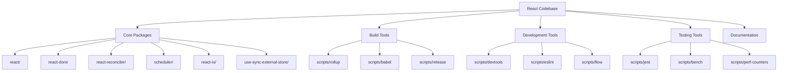
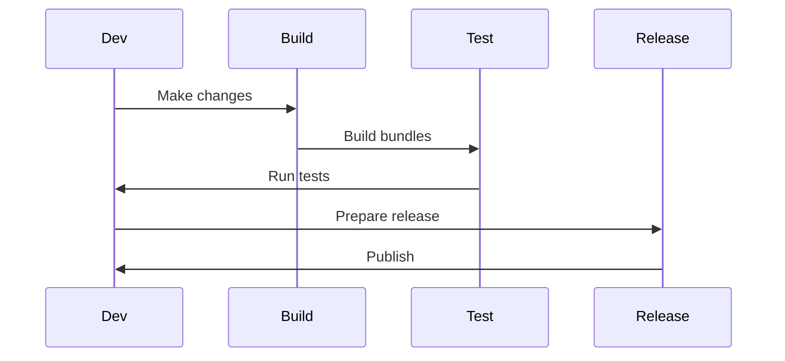
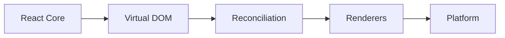
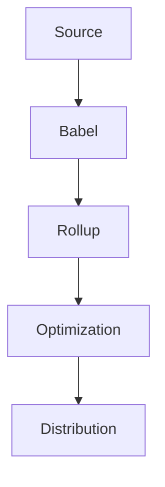
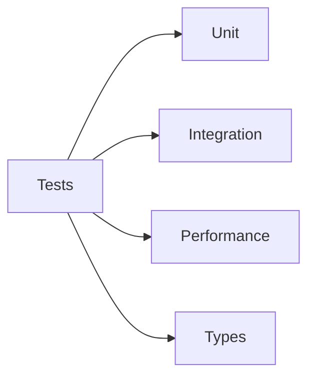

# React Source Code Explorer

Welcome to the React Source Code Explorer! This guide helps you understand React's source code architecture through interactive diagrams, code walkthroughs, and hands-on exercises.

## Project Overview



## Core Packages Documentation

### React Core
- [React Package](packages/react/README.md) - Core React APIs and Components
  - Component System
  - Hooks Architecture
  - Event System
  - Build Variants

### Renderers
- [React DOM](packages/react-dom/README.md) - DOM Renderer
  - Client Rendering
  - Server Rendering
  - Hydration
  - Event System

### Core Infrastructure
- [React Reconciler](packages/react-reconciler/README.md) - Reconciliation Algorithm
  - Fiber Architecture
  - Work Loop
  - Priority System
  - Effect System

- [Scheduler](packages/scheduler/README.md) - Task Scheduling
  - Priority Levels
  - Time Slicing
  - Task Queue
  - Frame Management

### Utilities
- [React Is](packages/react-is/README.md) - Type Checking
  - Element Validation
  - Component Detection
  - Context Checking
  - Type System

- [useSyncExternalStore](packages/use-sync-external-store/README.md) - External Store Integration
  - Store Subscription
  - State Synchronization
  - Server Rendering
  - Selection API

## Interactive Learning

Each package documentation includes interactive knowledge testing sections:

### Example Quiz: Scheduler
1. What is the main purpose of the scheduler?
   - [ ] Memory management
   - [x] Task prioritization
   - [ ] State management
   - [ ] Event handling

### Example Quiz: React Is
1. What is the main purpose of react-is?
   - [ ] Component creation
   - [x] Type checking
   - [ ] State management
   - [ ] Event handling

### Example Quiz: useSyncExternalStore
1. What is the main purpose of useSyncExternalStore?
   - [ ] State management
   - [x] External store sync
   - [ ] Data fetching
   - [ ] Event handling

## Directory Structure

### Core Packages
- `packages/react/` - Core React APIs and Components
- `packages/react-dom/` - React DOM Renderer
- `packages/react-reconciler/` - Reconciliation Algorithm
- `packages/scheduler/` - Task Scheduling
- `packages/shared/` - Shared Utilities
- `packages/react-is/` - Type Checking
- `packages/use-sync-external-store/` - External Store Integration

### Build and Release (`scripts/`)
1. [**Rollup System**](scripts/rollup/README.md)
   - Bundle creation and optimization
   - Platform-specific builds
   - Development and production builds

2. [**Babel Configuration**](scripts/babel/README.md)
   - Code transformation
   - JSX processing
   - Feature flags

3. [**Release Management**](scripts/release/README.md)
   - Release channels (Stable, Experimental, Canary)
   - Version management
   - Publishing workflow

### Development Tools
1. [**DevTools**](scripts/devtools/README.md)
   - Component inspection
   - Performance profiling
   - Debugging tools

2. [**ESLint Configuration**](scripts/eslint/README.md)
   - Code style enforcement
   - Best practices
   - Error prevention

3. [**Flow Type System**](scripts/flow/README.md)
   - Type checking
   - Type definitions
   - Platform-specific types

### Testing and Performance
1. [**Jest Framework**](scripts/jest/README.md)
   - Unit testing
   - Integration testing
   - Test utilities

2. [**Benchmarking**](scripts/bench/README.md)
   - Performance testing
   - Metrics collection
   - Regression detection

3. [**Performance Counters**](scripts/perf-counters/README.md)
   - Runtime metrics
   - Memory monitoring
   - Event tracking

## Development Workflow



## Getting Started

1. **Setup Development Environment**
```bash
# Clone repository
git clone https://github.com/facebook/react.git
cd react

# Install dependencies
yarn install

# Build React
yarn build
```

2. **Run Tests**
```bash
# Run all tests
yarn test

# Run specific tests
yarn test --pattern=ComponentName
```

3. **Development Build**
```bash
# Start development build
yarn dev

# Build with specific features
yarn build --features=concurrent
```

## Contributing

### Development Process
1. Fork the repository
2. Create a feature branch
3. Make your changes
4. Run tests and linting
5. Submit a pull request

### Code Quality
- Follow ESLint rules
- Add Flow types
- Write tests
- Update documentation

### Testing Guidelines
1. Unit test components
2. Add integration tests
3. Include performance tests
4. Test across platforms

## Architecture Deep Dive

### Core Concepts



### Build Process



### Test Coverage



## Additional Resources

- [React Documentation](https://react.dev/docs/getting-started)
- [Contributing Guide](CONTRIBUTING.md)
- [React Blog](https://react.dev/blog)
- [GitHub Repository](https://github.com/facebook/react)

## License

React is MIT licensed. See the [LICENSE](LICENSE) file for details.
