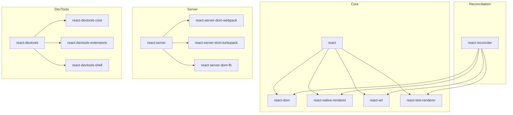
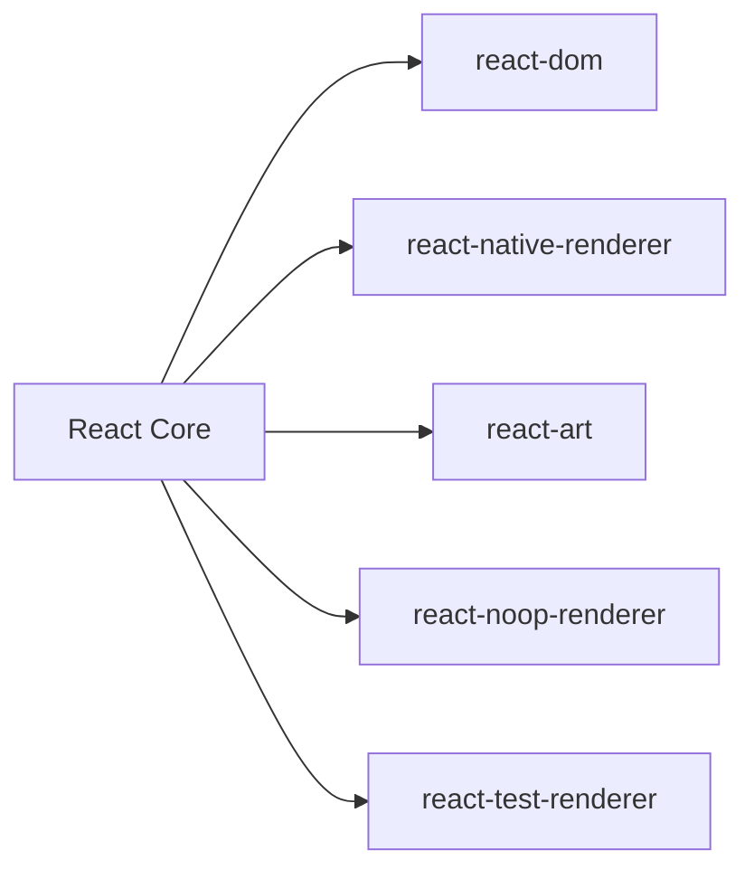
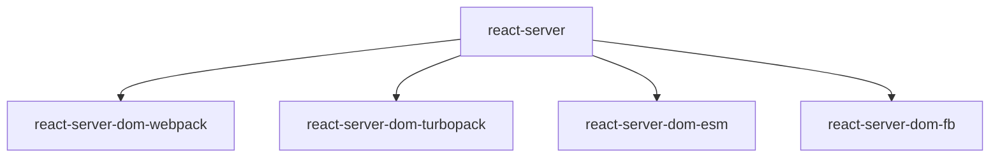
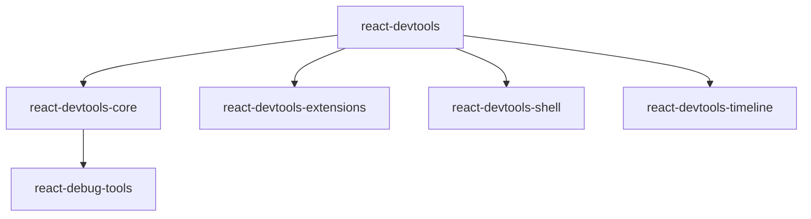
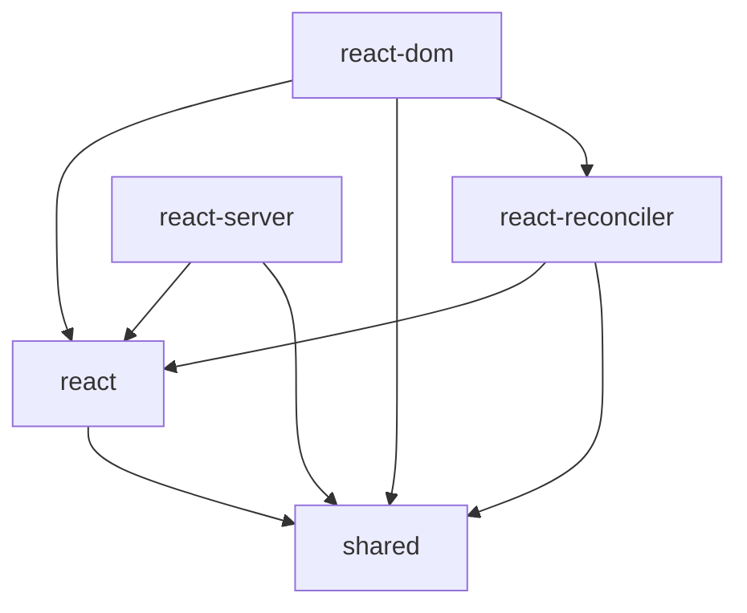

# React Packages

This directory contains all the packages that make up the React ecosystem. Each package serves a specific purpose in React's architecture and can be used independently or in combination with others.

## Package Architecture



## Package Categories

### Core Packages
1. **[`react`](react/)**
   - Core React APIs
   - Component definitions
   - Hooks implementation
   - React elements

2. **[`react-dom`](react-dom/)**
   - DOM renderer
   - Browser integration
   - Event system
   - Server rendering

3. **[`react-reconciler`](react-reconciler/)**
   - Reconciliation algorithm
   - Fiber architecture
   - Scheduling
   - Rendering pipeline

4. **[`scheduler`](scheduler/)**
   - Task scheduling
   - Priority management
   - Time slicing
   - Concurrency control

### Renderers



1. **[`react-dom`](react-dom/)** - Web platform renderer
2. **[`react-native-renderer`](react-native-renderer/)** - React Native renderer
3. **[`react-art`](react-art/)** - Canvas/SVG renderer
4. **[`react-test-renderer`](react-test-renderer/)** - Testing renderer
5. **[`react-noop-renderer`](react-noop-renderer/)** - Benchmarking renderer

### Server Packages



1. **[`react-server`](react-server/)**
   - Server-side rendering
   - Streaming support
   - Suspense handling

2. **Server Integrations**
   - [`react-server-dom-webpack`](react-server-dom-webpack/)
   - [`react-server-dom-turbopack`](react-server-dom-turbopack/)
   - [`react-server-dom-esm`](react-server-dom-esm/)

### Development Tools



1. **[`react-devtools`](react-devtools/)**
   - Component inspection
   - Performance profiling
   - Debugging tools

2. **DevTools Ecosystem**
   - [`react-devtools-core`](react-devtools-core/)
   - [`react-devtools-extensions`](react-devtools-extensions/)
   - [`react-debug-tools`](react-debug-tools/)

### Testing Utilities

1. **[`jest-react`](jest-react/)**
   - Jest matchers
   - Test utilities
   - Mocking helpers

2. **Testing Support**
   - [`react-test-renderer`](react-test-renderer/)
   - [`react-suspense-test-utils`](react-suspense-test-utils/)
   - [`dom-event-testing-library`](dom-event-testing-library/)

### Shared Utilities

1. **[`shared`](shared/)**
   - Common utilities
   - Type definitions
   - Constants

2. **Hooks Utilities**
   - [`use-subscription`](use-subscription/)
   - [`use-sync-external-store`](use-sync-external-store/)

## Development

### Building Packages
```bash
# Build all packages
yarn build

# Build specific package
yarn build react

# Build with specific configuration
yarn build --type=NODE_DEV
```

### Testing Packages
```bash
# Run all tests
yarn test

# Test specific package
yarn test react-dom

# Test with specific pattern
yarn test --pattern="Component"
```

### Package Dependencies



## Contributing

When working with packages:

1. Maintain backward compatibility
2. Update dependencies carefully
3. Add proper documentation
4. Include tests
5. Consider bundle size

## Package Stability

- 🟢 **Stable**: Production-ready
- 🟡 **Experimental**: In development
- 🔴 **Internal**: Not for public use

| Package | Stability | Description |
|---------|-----------|-------------|
| react | 🟢 | Core React package |
| react-dom | 🟢 | DOM renderer |
| react-server | 🟡 | Server components |
| shared | 🔴 | Internal utilities |

## Documentation

Each package should contain:
1. README.md with usage instructions
2. API documentation
3. Example code
4. Contributing guidelines 
