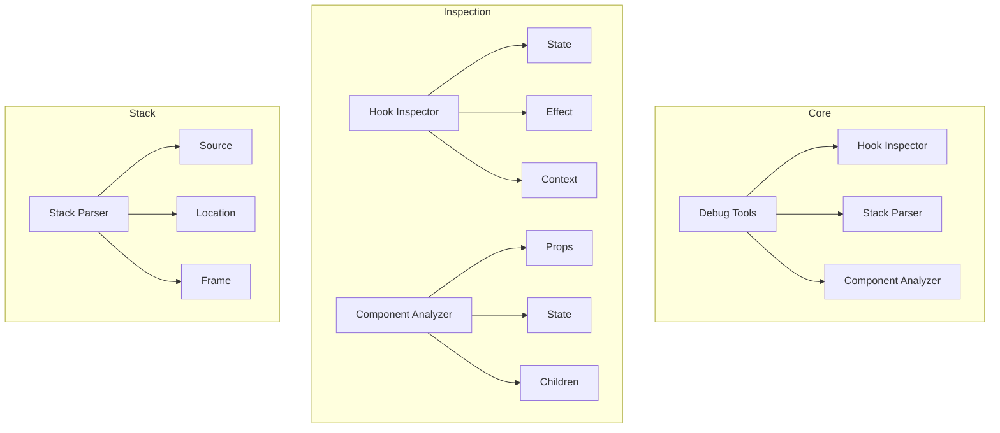
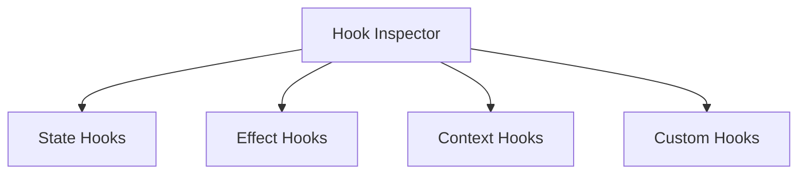
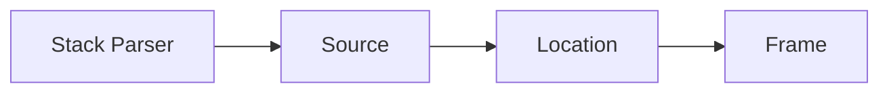
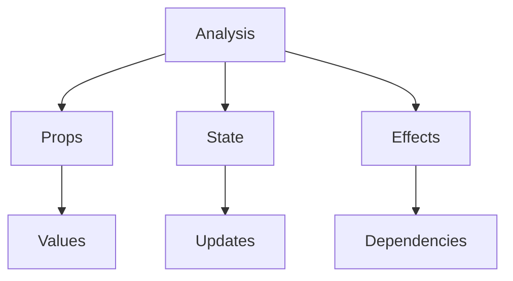
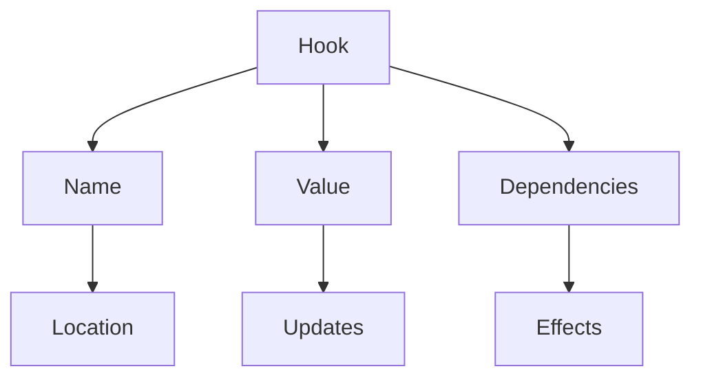
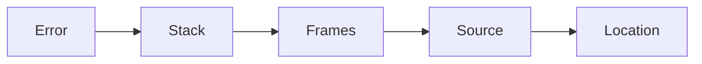

# React Debug Tools Package

The `react-debug-tools` package provides debugging utilities for React applications, enabling developers to inspect and analyze React components, hooks, and their internal state during development.

## Architecture



## Key Components

### 1. Hook Inspector


- **State Hooks**: useState, useReducer analysis
- **Effect Hooks**: useEffect, useLayoutEffect tracking
- **Context Hooks**: useContext inspection
- **Custom Hooks**: User-defined hooks analysis

### 2. Stack Parser


1. **Source**
   - File identification
   - Line numbers
   - Column positions

2. **Frame**
   - Function names
   - Component hierarchy
   - Hook calls

### 3. Component Analysis


- **Props**: Prop inspection and tracking
- **State**: State management analysis
- **Effects**: Side effect monitoring

## Usage

### Hook Inspection
```javascript
import { inspectHooks } from 'react-debug-tools';

function Counter() {
  const [count, setCount] = useState(0);
  useEffect(() => {
    document.title = `Count: ${count}`;
  }, [count]);
  
  return <button onClick={() => setCount(c => c + 1)}>{count}</button>;
}

const hooks = inspectHooks(Counter);
console.log(hooks);
// [
//   { name: 'State', value: 0, setValue: [Function] },
//   { name: 'Effect', deps: [0], destroy: undefined }
// ]
```

### Stack Analysis
```javascript
import { getStackByFiberInDevTools } from 'react-debug-tools';

function ComponentA() {
  return <ComponentB />;
}

function ComponentB() {
  throw new Error('Test error');
}

try {
  render(<ComponentA />);
} catch (error) {
  const stack = getStackByFiberInDevTools(error);
  console.log(stack);
  // ComponentB
  // ComponentA
  // ...
}
```

### Component Analysis
```javascript
import { inspectElement } from 'react-debug-tools';

function MyComponent({ value }) {
  const [state, setState] = useState(value);
  
  return <div>{state}</div>;
}

const analysis = inspectElement(<MyComponent value={42} />);
console.log(analysis);
// {
//   props: { value: 42 },
//   hooks: [{ name: 'State', value: 42 }],
//   children: [{ type: 'div', props: {}, children: ['42'] }]
// }
```

## Development

### Building
```bash
# Build the package
yarn build

# Build with source maps
yarn build --sourcemap
```

### Testing
```bash
# Run all tests
yarn test

# Test specific feature
yarn test --pattern="hooks"
```

## Architecture Details

### Hook Analysis Model


### Stack Analysis


## Interactive Knowledge Testing

### Quiz: Debug Tools Basics

1. What is the main purpose of react-debug-tools?
   - [ ] Production monitoring
   - [x] Development debugging
   - [ ] Performance testing
   - [ ] Build optimization

2. What can be inspected with hook inspection?
   - [ ] Only useState
   - [x] All hooks
   - [ ] Only effects
   - [ ] Only context

3. What information is provided by stack analysis?
   - [ ] Only line numbers
   - [x] Component hierarchy
   - [ ] Only file names
   - [ ] Only function names

### Quiz: Hook Inspection

1. What method inspects hooks?
   - [ ] analyzeHooks
   - [x] inspectHooks
   - [ ] debugHooks
   - [ ] getHooks

2. What information is available for state hooks?
   - [ ] Only current value
   - [x] Value and setter
   - [ ] Only updates
   - [ ] Only type

3. What can be analyzed in effects?
   - [ ] Only cleanup
   - [x] Dependencies and cleanup
   - [ ] Only timing
   - [ ] Only dependencies

### Quiz: Stack Analysis

1. How is component stack obtained?
   - [ ] getStack
   - [x] getStackByFiberInDevTools
   - [ ] getTrace
   - [ ] getDebugStack

2. What triggers stack collection?
   - [ ] Any render
   - [x] Error thrown
   - [ ] Hook call
   - [ ] State update

3. What details are in stack frames?
   - [ ] Only line numbers
   - [x] Component names and locations
   - [ ] Only file names
   - [ ] Only function names

## Contributing

When contributing to React Debug Tools:

1. Follow the [Contributing Guide](../CONTRIBUTING.md)
2. Add test coverage
3. Consider performance impact
4. Maintain backward compatibility
5. Update documentation

## Stability

- 🟢 **Stable**: Core debugging APIs
- 🟡 **Experimental**: New features
- 🔴 **Internal**: Facebook-specific

## Documentation

- [React DevTools](https://react.dev/devtools)
- [Debugging](https://react.dev/debugging)
- [Hook Inspection](https://react.dev/hook-inspection)
