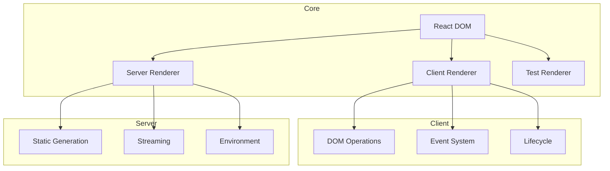
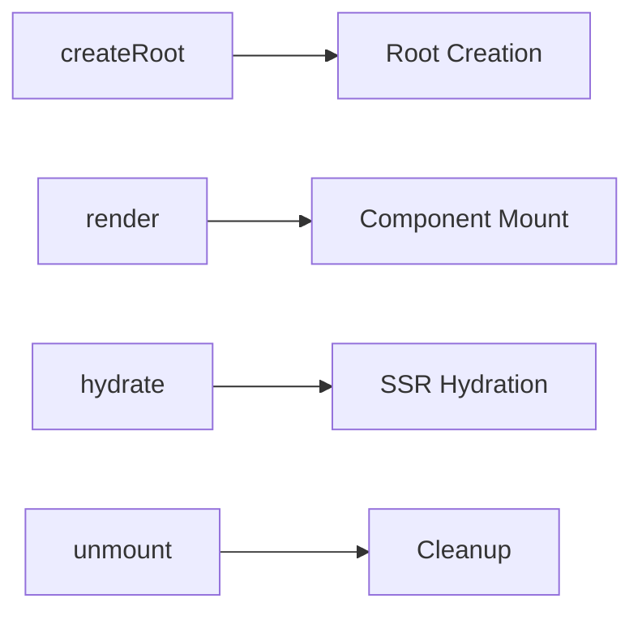
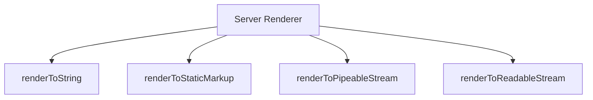
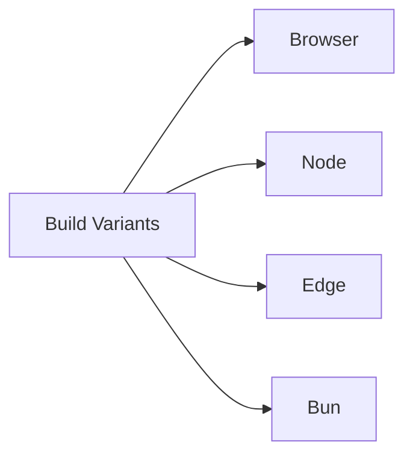
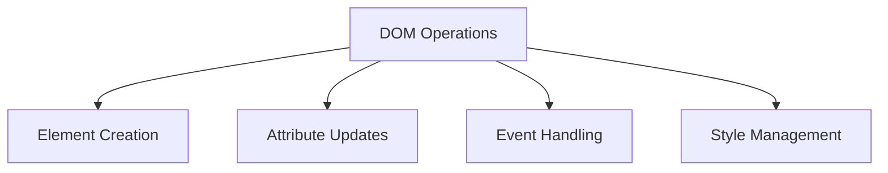
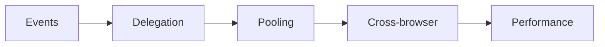

# React DOM Package

The `react-dom` package serves as the entry point to the DOM and server renderers for React. It provides the necessary methods to render React components to the DOM and handle browser-specific functionality.

## Architecture



## Key Components

### 1. Client-Side Rendering


- `createRoot` - Creates a new root for concurrent rendering
- `render` - Renders a React element into the DOM
- `hydrate` - Hydrates a server-rendered container
- `unmount` - Unmounts a React tree from the DOM

### 2. Server-Side Rendering


- `renderToString` - Renders to a string
- `renderToStaticMarkup` - Renders to static HTML
- `renderToPipeableStream` - Renders to a Node.js stream
- `renderToReadableStream` - Renders to a Web Stream

### 3. Environment-Specific Builds


- `client.js` - Browser client entry
- `server.node.js` - Node.js server renderer
- `server.edge.js` - Edge runtime renderer
- `server.bun.js` - Bun runtime renderer

## Usage

### Client-Side Rendering
```javascript
import { createRoot } from 'react-dom/client';

function App() {
  return <h1>Hello, world!</h1>;
}

const root = createRoot(document.getElementById('root'));
root.render(<App />);
```

### Server-Side Rendering
```javascript
import { renderToString } from 'react-dom/server';

function App() {
  return <h1>Hello, server!</h1>;
}

const html = renderToString(<App />);
```

### Hydration
```javascript
import { hydrateRoot } from 'react-dom/client';

function App() {
  return <h1>Hello, hydrated!</h1>;
}

const root = hydrateRoot(
  document.getElementById('root'),
  <App />
);
```

## Development

### Building
```bash
# Build all variants
yarn build

# Build specific variant
yarn build --variant=development
```

### Testing
```bash
# Run all tests
yarn test

# Test specific feature
yarn test --pattern="client"
```

## Architecture Details

### DOM Operations


### Event System


## Contributing

When contributing to React DOM:

1. Follow the [Contributing Guide](../CONTRIBUTING.md)
2. Test across different browsers
3. Consider performance implications
4. Maintain backward compatibility
5. Update documentation

## Stability

- 🟢 **Stable**: Core rendering APIs
- 🟡 **Experimental**: New features
- 🔴 **Internal**: Facebook-specific features

## Documentation

- [React DOM Documentation](https://react.dev/reference/react-dom)
- [Client APIs](https://react.dev/reference/react-dom/client)
- [Server APIs](https://react.dev/reference/react-dom/server)
