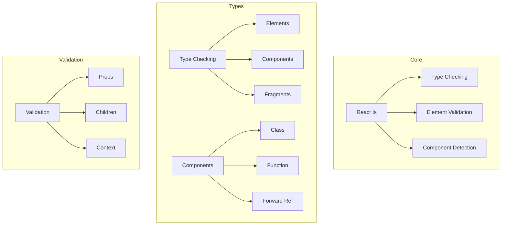
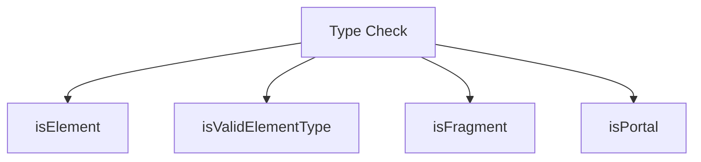
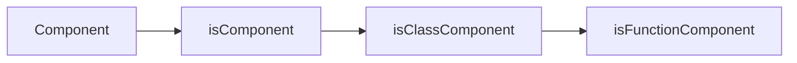
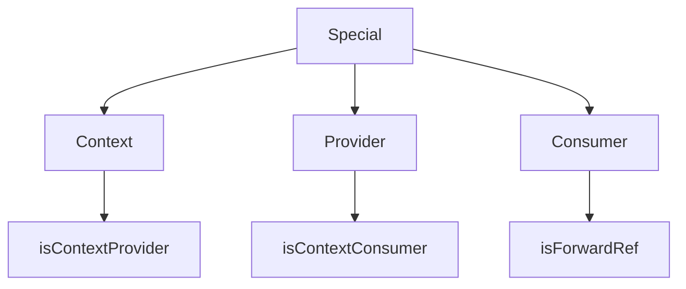
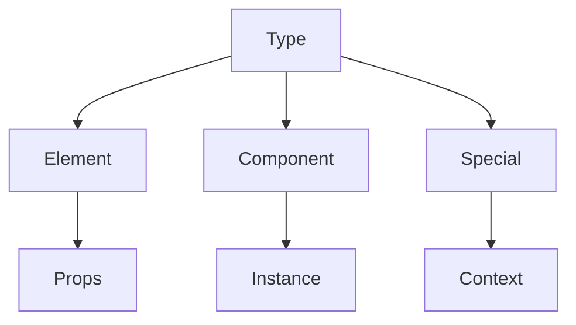
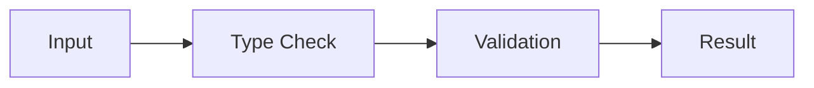

# React Is Package

The `react-is` package provides runtime type checking capabilities for React elements and components, allowing you to determine the type of React objects and validate their structure.

## Architecture



## Key Components

### 1. Type Checking


- **isElement**: React element validation
- **isValidElementType**: Component type checking
- **isFragment**: Fragment detection
- **isPortal**: Portal identification

### 2. Component Types


1. **Class Components**
   - Class detection
   - Inheritance checking
   - Lifecycle validation

2. **Function Components**
   - Function detection
   - Hook compatibility
   - Props validation

### 3. Special Types


- **Context**: Context object detection
- **Provider/Consumer**: Context parts
- **Forward Ref**: Ref forwarding

## Usage

### Basic Type Checking
```javascript
import {
  isElement,
  isValidElementType,
  isFragment
} from 'react-is';

// Check if something is a React element
const element = <div>Hello</div>;
console.log(isElement(element)); // true

// Check if something can be a React component
const Component = () => <div>Hello</div>;
console.log(isValidElementType(Component)); // true

// Check if something is a Fragment
const fragment = <React.Fragment><div>Hello</div></React.Fragment>;
console.log(isFragment(fragment)); // true
```

### Component Type Checking
```javascript
import {
  isValidElementType,
  typeOf
} from 'react-is';

class ClassComponent extends React.Component {
  render() {
    return <div>Hello</div>;
  }
}

function FunctionComponent() {
  return <div>Hello</div>;
}

console.log(typeOf(<ClassComponent />)); // Symbol(react.element)
console.log(isValidElementType(ClassComponent)); // true
console.log(isValidElementType(FunctionComponent)); // true
```

### Context Checking
```javascript
import {
  isContextProvider,
  isContextConsumer
} from 'react-is';

const MyContext = React.createContext(null);

console.log(isContextProvider(<MyContext.Provider value={null} />)); // true
console.log(isContextConsumer(<MyContext.Consumer>{() => null}</MyContext.Consumer>)); // true
```

## Development

### Building
```bash
# Build the package
yarn build

# Build with profiling
yarn build --profiling
```

### Testing
```bash
# Run all tests
yarn test

# Test specific feature
yarn test --pattern="type"
```

## Architecture Details

### Type System


### Validation Flow


## Interactive Knowledge Testing

### Quiz: Type Checking Basics

1. What is the main purpose of react-is?
   - [ ] Component creation
   - [x] Type checking
   - [ ] State management
   - [ ] Event handling

2. What can be checked with isElement?
   - [ ] Only DOM elements
   - [x] Any React element
   - [ ] Only components
   - [ ] Only HTML

3. What does isValidElementType check?
   - [ ] Element rendering
   - [x] Component type validity
   - [ ] Props types
   - [ ] Children types

### Quiz: Component Types

1. How to check for class components?
   - [ ] isClass()
   - [x] typeOf()
   - [ ] instanceof
   - [ ] isClassComponent()

2. What identifies a function component?
   - [ ] Function type
   - [x] Return value
   - [ ] Props object
   - [ ] Name prefix

3. What can be validated with typeOf?
   - [ ] Only elements
   - [x] Elements and types
   - [ ] Only components
   - [ ] Only DOM

### Quiz: Special Types

1. How to check for Context.Provider?
   - [ ] isProvider
   - [x] isContextProvider
   - [ ] isContext
   - [ ] checkProvider

2. What identifies a Fragment?
   - [ ] null children
   - [x] Symbol type
   - [ ] Array return
   - [ ] Empty props

3. What is a valid element type?
   - [ ] Only classes
   - [x] Classes and functions
   - [ ] Only functions
   - [ ] Only strings

## Contributing

When contributing to React Is:

1. Follow the [Contributing Guide](../CONTRIBUTING.md)
2. Add test coverage
3. Consider type system impact
4. Maintain backward compatibility
5. Update documentation

## Stability

- 🟢 **Stable**: Core type checking
- 🟡 **Experimental**: New types
- 🔴 **Internal**: Facebook-specific

## Documentation

- [Type Checking](https://react.dev/types)
- [Component Types](https://react.dev/types/components)
- [Special Types](https://react.dev/types/special)
