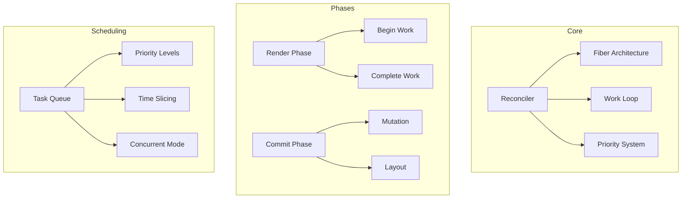
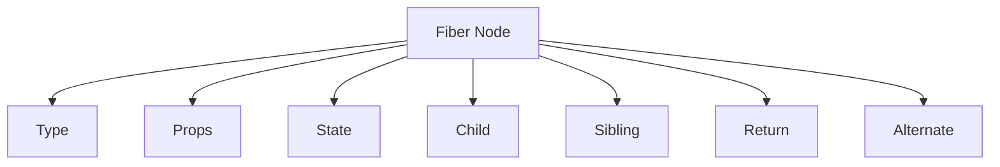
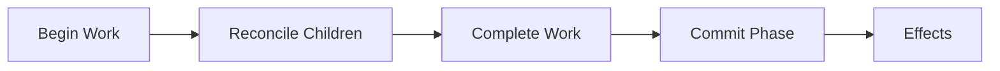
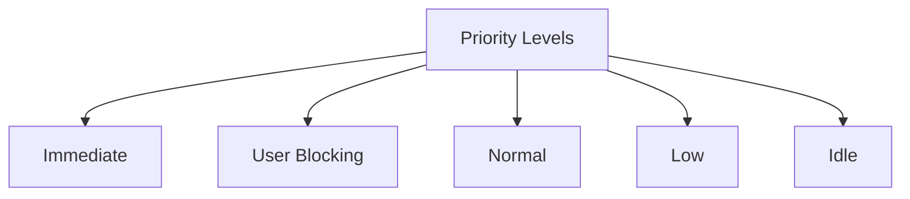
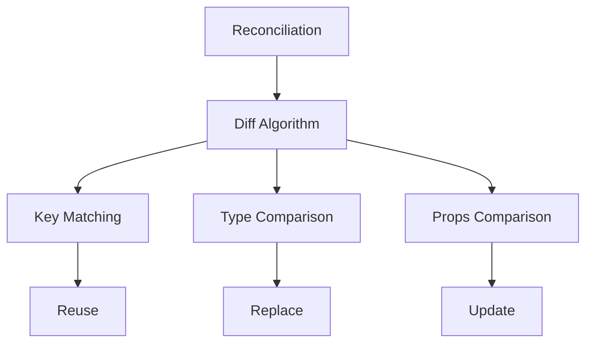
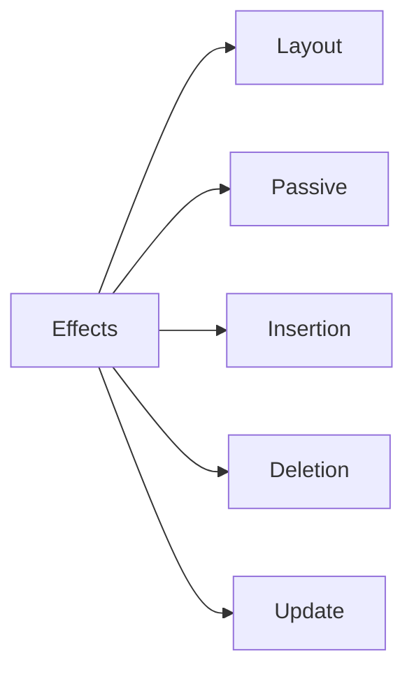

# React Reconciler Package

The `react-reconciler` package implements React's reconciliation algorithm, which is responsible for efficiently updating the UI by comparing the new and previous component trees.

## Architecture



## Key Components

### 1. Fiber Architecture


- **Type**: Component type (function/class)
- **Props**: Current props
- **State**: Component state
- **Child**: First child fiber
- **Sibling**: Next sibling fiber
- **Return**: Parent fiber
- **Alternate**: Work-in-progress fiber

### 2. Work Loop


1. **Begin Work**
   - Create new fibers
   - Update existing fibers
   - Handle side effects

2. **Complete Work**
   - Prepare for commit
   - Mark effects
   - Update refs

3. **Commit Phase**
   - Apply mutations
   - Run effects
   - Update refs

### 3. Priority System


- **Immediate**: Critical updates
- **User Blocking**: User interactions
- **Normal**: Regular updates
- **Low**: Background tasks
- **Idle**: Non-urgent work

## Usage

### Creating a Custom Renderer
```javascript
import { Reconciler } from 'react-reconciler';

const hostConfig = {
  createInstance(type, props) {
    // Create native instance
  },
  createTextInstance(text) {
    // Create text node
  },
  appendInitialChild(parent, child) {
    // Append child to parent
  },
  // ... other host config methods
};

const reconciler = Reconciler(hostConfig);
```

### Implementing Host Config
```javascript
const hostConfig = {
  // Instance Management
  createInstance,
  createTextInstance,
  appendInitialChild,
  removeChild,
  insertBefore,
  
  // Props Management
  prepareUpdate,
  commitUpdate,
  commitTextUpdate,
  
  // Event System
  getRootHostContext,
  getChildHostContext,
  
  // Scheduling
  scheduleTimeout,
  cancelTimeout,
  noTimeout,
  
  // Misc
  shouldSetTextContent,
  isPrimaryRenderer,
  supportsMutation,
  supportsPersistence,
  supportsHydration
};
```

## Development

### Building
```bash
# Build the package
yarn build

# Build with profiling
yarn build --profiling
```

### Testing
```bash
# Run all tests
yarn test

# Test specific feature
yarn test --pattern="fiber"
```

## Architecture Details

### Reconciliation Process


### Effect System


## Contributing

When contributing to React Reconciler:

1. Follow the [Contributing Guide](../CONTRIBUTING.md)
2. Understand the Fiber architecture
3. Consider performance implications
4. Maintain backward compatibility
5. Update documentation

## Stability

- 🟢 **Stable**: Core reconciliation algorithm
- 🟡 **Experimental**: New features
- 🔴 **Internal**: Facebook-specific features

## Documentation

- [Reconciler Documentation](https://react.dev/architecture/reconciler)
- [Fiber Architecture](https://react.dev/architecture/fiber)
- [Concurrent Mode](https://react.dev/architecture/concurrent)
