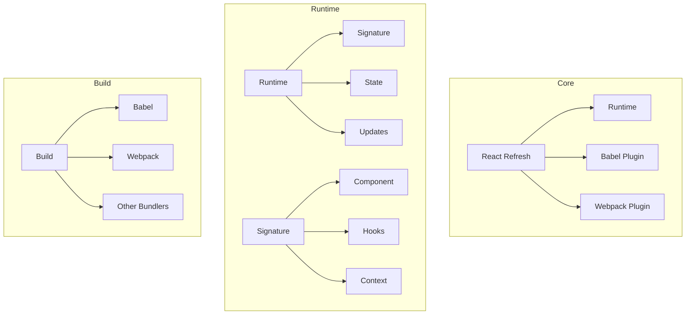
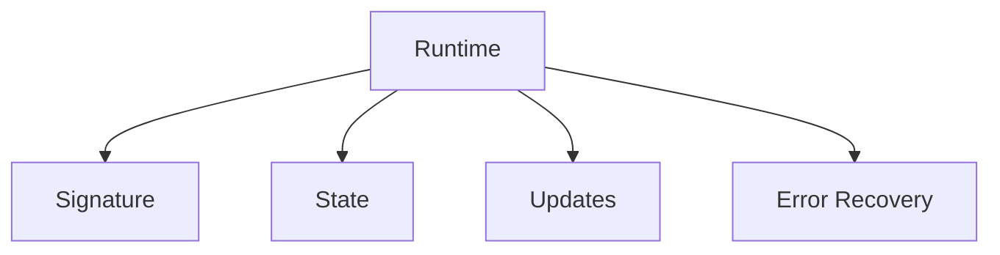
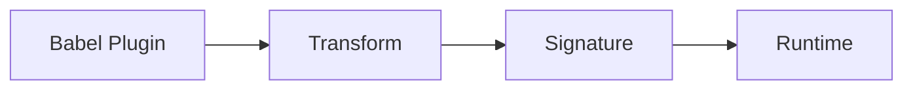
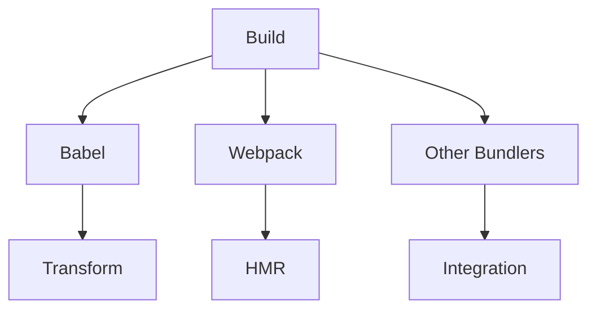
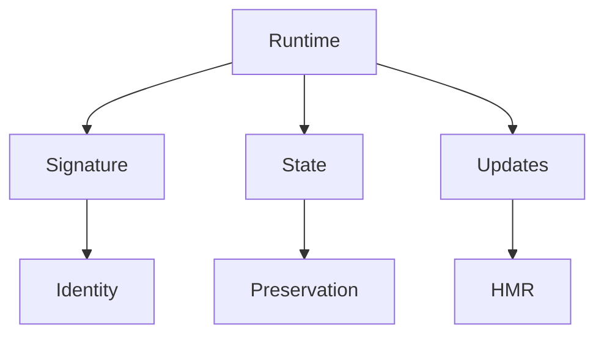
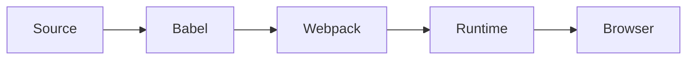

# React Refresh Package

The `react-refresh` package provides fast refresh capabilities for React components during development, allowing for instant updates to components without losing their state.

## Architecture



## Key Components

### 1. Runtime


- **Signature**: Component identity and dependencies
- **State**: Component state preservation
- **Updates**: Hot module replacement
- **Error Recovery**: Error boundary integration

### 2. Babel Plugin


1. **Transform**
   - Component wrapping
   - Hook detection
   - Signature generation

2. **Signature**
   - Component identity
   - Hook dependencies
   - Context usage

### 3. Build Integration


- **Babel**: Code transformation
- **Webpack**: HMR integration
- **Other Bundlers**: Plugin support

## Usage

### Basic Setup
```javascript
// babel.config.js
module.exports = {
  plugins: ['react-refresh/babel']
};

// webpack.config.js
const ReactRefreshWebpackPlugin = require('@pmmmwh/react-refresh-webpack-plugin');

module.exports = {
  plugins: [new ReactRefreshWebpackPlugin()]
};
```

### Component Updates
```javascript
function Counter() {
  const [count, setCount] = useState(0);
  
  return (
    <div>
      <p>Count: {count}</p>
      <button onClick={() => setCount(c => c + 1)}>
        Increment
      </button>
    </div>
  );
}

// Edit the component - state is preserved
function Counter() {
  const [count, setCount] = useState(0);
  
  return (
    <div>
      <p>Count: {count}</p>
      <button onClick={() => setCount(c => c + 1)}>
        Increment (+1)
      </button>
    </div>
  );
}
```

### Error Recovery
```javascript
function BuggyComponent() {
  // This will cause an error
  const value = undefined.property;
  
  return <div>{value}</div>;
}

// Error is caught and component can be fixed
function BuggyComponent() {
  const value = 'fixed';
  return <div>{value}</div>;
}
```

## Development

### Building
```bash
# Build the package
yarn build

# Build with profiling
yarn build --profiling
```

### Testing
```bash
# Run all tests
yarn test

# Test specific feature
yarn test --pattern="runtime"
```

## Architecture Details

### Runtime Model


### Build Integration


## Interactive Knowledge Testing

### Quiz: Fast Refresh Basics

1. What is the main purpose of react-refresh?
   - [ ] Production optimization
   - [x] Development hot reloading
   - [ ] Server-side rendering
   - [ ] Build optimization

2. What is preserved during fast refresh?
   - [ ] DOM state
   - [x] Component state
   - [ ] Global variables
   - [ ] Event listeners

3. What triggers a full reload?
   - [ ] Component props change
   - [ ] Hook dependencies change
   - [x] Component type changes
   - [ ] State updates

### Quiz: Build Integration

1. What Babel plugin is required?
   - [ ] @babel/plugin-transform-react
   - [x] react-refresh/babel
   - [ ] @babel/preset-react
   - [ ] babel-plugin-react-refresh

2. What Webpack plugin is needed?
   - [ ] webpack-hot-middleware
   - [x] @pmmmwh/react-refresh-webpack-plugin
   - [ ] webpack-dev-server
   - [ ] react-hot-loader

3. What file changes trigger refresh?
   - [ ] Any file
   - [x] Component files
   - [ ] Config files
   - [ ] Test files

### Quiz: Error Handling

1. How are errors handled during refresh?
   - [ ] Page reload
   - [x] Error boundary
   - [ ] Console only
   - [ ] Silent failure

2. What happens after fixing an error?
   - [ ] Manual refresh needed
   - [x] Automatic recovery
   - [ ] State is lost
   - [ ] Component unmounts

3. What errors cause full reload?
   - [ ] Runtime errors
   - [ ] Syntax errors
   - [x] Module errors
   - [ ] State errors

## Contributing

When contributing to React Refresh:

1. Follow the [Contributing Guide](../CONTRIBUTING.md)
2. Test across bundlers
3. Consider edge cases
4. Maintain backward compatibility
5. Update documentation

## Stability

- 🟢 **Stable**: Core refresh functionality
- 🟡 **Experimental**: New features
- 🔴 **Internal**: Facebook-specific

## Documentation

- [Fast Refresh](https://react.dev/fast-refresh)
- [Babel Plugin](https://github.com/facebook/react/tree/main/packages/react-refresh)
- [Webpack Plugin](https://github.com/pmmmwh/react-refresh-webpack-plugin)
