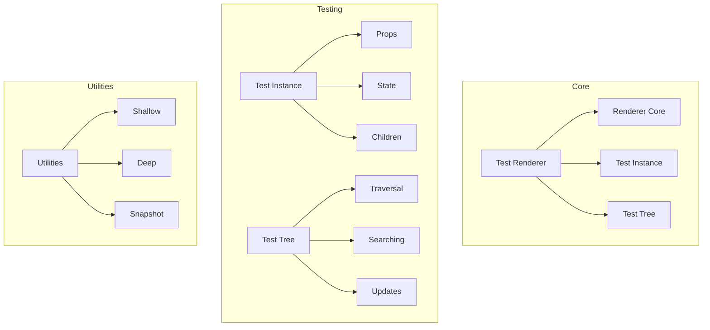
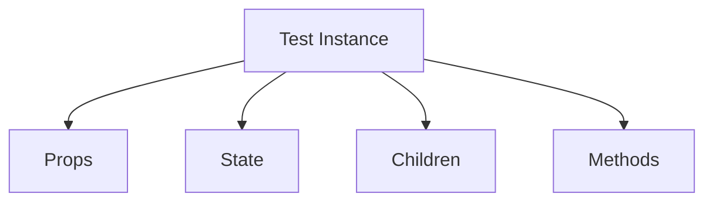
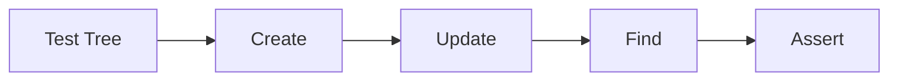
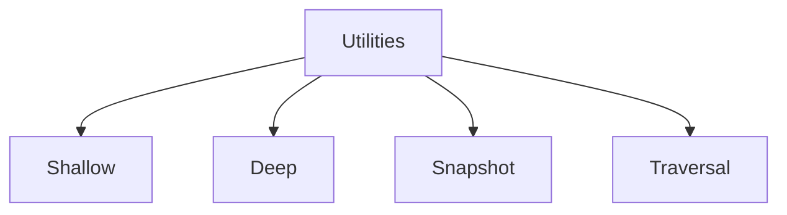
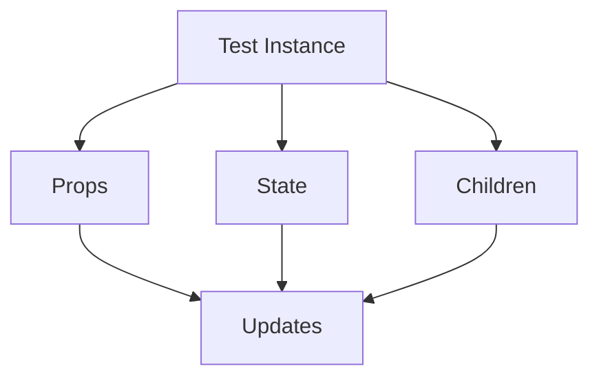
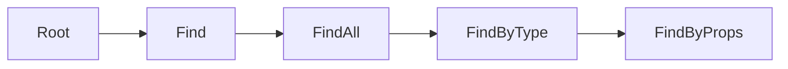

# React Test Renderer Package

The `react-test-renderer` package provides a React renderer that can be used to render React components to pure JavaScript objects, without depending on the DOM or a native mobile environment.

## Architecture



## Key Components

### 1. Test Instance


- **Props**: Component props
- **State**: Component state
- **Children**: Child components
- **Methods**: Instance methods

### 2. Test Tree


1. **Create**
   - Render component
   - Build tree
   - Initialize state

2. **Update**
   - Props changes
   - State updates
   - Re-renders

### 3. Testing Utilities


- **Shallow**: Shallow rendering
- **Deep**: Full rendering
- **Snapshot**: Snapshot testing
- **Traversal**: Tree traversal

## Usage

### Basic Testing
```javascript
import TestRenderer from 'react-test-renderer';

function Link({page, children}) {
  return <a href={page}>{children}</a>;
}

const testRenderer = TestRenderer.create(
  <Link page="https://www.facebook.com/">Facebook</Link>
);

console.log(testRenderer.toJSON());
// { type: 'a',
//   props: { href: 'https://www.facebook.com/' },
//   children: [ 'Facebook' ] }
```

### Instance Testing
```javascript
class MyComponent extends React.Component {
  constructor(props) {
    super(props);
    this.state = {count: 0};
  }
  
  render() {
    return (
      <button onClick={() => this.setState({count: this.state.count + 1})}>
        Count: {this.state.count}
      </button>
    );
  }
}

const testRenderer = TestRenderer.create(<MyComponent />);
const testInstance = testRenderer.root;

// Find button and trigger click
const button = testInstance.findByType('button');
button.props.onClick();

// Test state update
expect(testInstance.state.count).toBe(1);
```

### Snapshot Testing
```javascript
import TestRenderer from 'react-test-renderer';

function MyComponent() {
  return (
    <div>
      <h1>Hello World</h1>
      <p>This is a test</p>
    </div>
  );
}

const tree = TestRenderer
  .create(<MyComponent />)
  .toJSON();
  
expect(tree).toMatchSnapshot();
```

## Development

### Building
```bash
# Build the package
yarn build

# Build with profiling
yarn build --profiling
```

### Testing
```bash
# Run all tests
yarn test

# Test specific feature
yarn test --pattern="instance"
```

## Architecture Details

### Test Instance Model


### Tree Traversal


## Interactive Knowledge Testing

### Quiz: Test Renderer Basics

1. What is the main purpose of react-test-renderer?
   - [ ] Render to DOM
   - [x] Render to JavaScript objects
   - [ ] Render to native
   - [ ] Render to server

2. How do you create a test renderer instance?
   - [ ] new TestRenderer()
   - [x] TestRenderer.create()
   - [ ] TestRenderer.render()
   - [ ] TestRenderer.mount()

3. What method converts the renderer output to JSON?
   - [ ] toObject()
   - [x] toJSON()
   - [ ] toString()
   - [ ] toTree()

### Quiz: Test Instance

1. How do you access the root instance?
   - [ ] testRenderer.instance
   - [x] testRenderer.root
   - [ ] testRenderer.getRoot()
   - [ ] testRenderer.getInstance()

2. What method finds a component by type?
   - [ ] findComponent()
   - [x] findByType()
   - [ ] getByType()
   - [ ] queryByType()

3. How do you update props in a test?
   - [ ] updateProps()
   - [x] update()
   - [ ] setProps()
   - [ ] changeProps()

### Quiz: Snapshot Testing

1. What is snapshot testing used for?
   - [ ] Performance testing
   - [x] Output comparison
   - [ ] State management
   - [ ] Event handling

2. How do you create a snapshot?
   - [ ] createSnapshot()
   - [x] toMatchSnapshot()
   - [ ] makeSnapshot()
   - [ ] takeSnapshot()

3. What updates a snapshot?
   - [ ] --update
   - [x] -u
   - [ ] --refresh
   - [ ] -r

## Contributing

When contributing to Test Renderer:

1. Follow the [Contributing Guide](../CONTRIBUTING.md)
2. Add test coverage
3. Consider performance
4. Maintain backward compatibility
5. Update documentation

## Stability

- 🟢 **Stable**: Core testing APIs
- 🟡 **Experimental**: New features
- 🔴 **Internal**: Facebook-specific

## Documentation

- [Test Renderer](https://react.dev/test-renderer)
- [Testing Recipes](https://react.dev/testing-recipes)
- [Snapshot Testing](https://react.dev/snapshot-testing)
