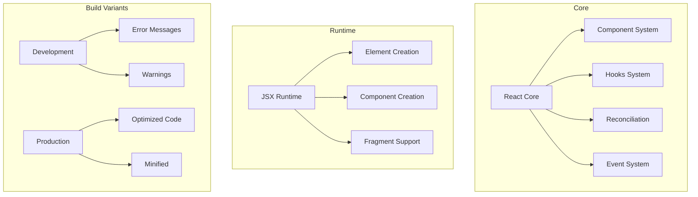
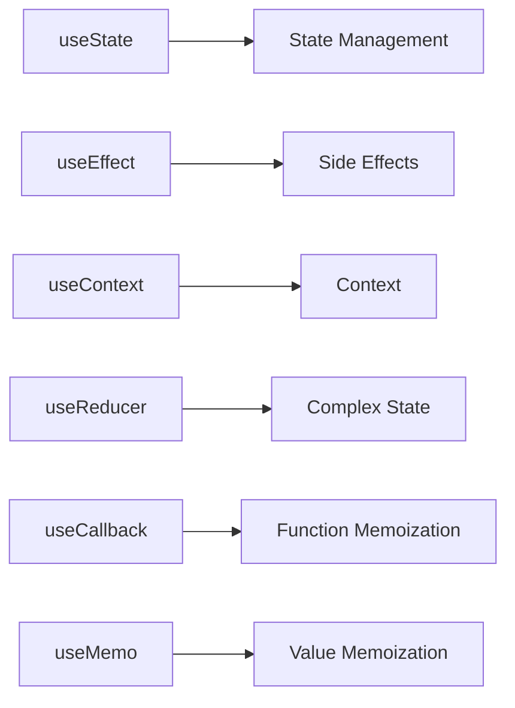
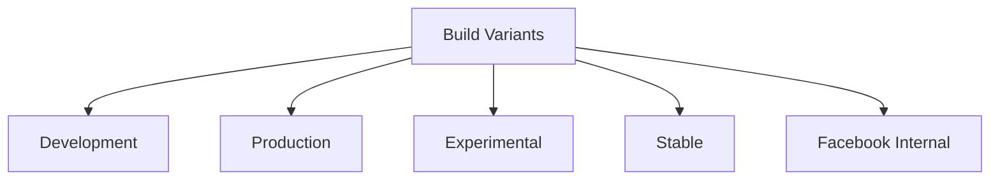
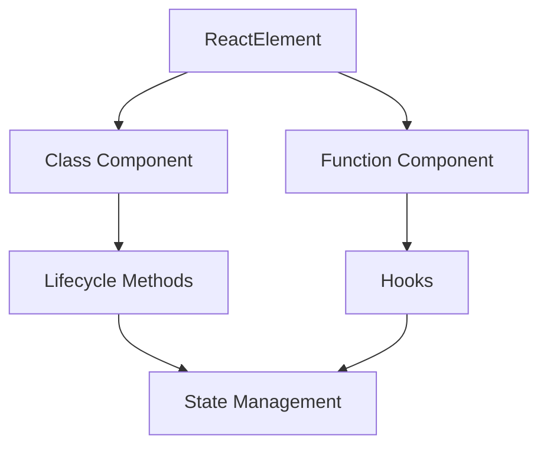
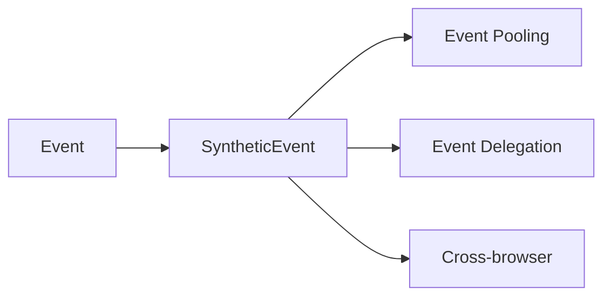

# React Core Package

The `react` package is the core of React's implementation, providing the fundamental APIs and functionality that make React work.

## Architecture



## Key Components

### 1. Core React APIs
- `createElement` - Creates React elements
- `Component` - Base class for class components
- `PureComponent` - Optimized component class
- `memo` - Memoization for function components
- `forwardRef` - Forward refs through components

### 2. Hooks System


### 3. JSX Runtime
- `jsx-runtime.js` - Production JSX transform
- `jsx-dev-runtime.js` - Development JSX transform
- `react-server.js` - Server-side JSX support

## Build Variants



1. **Development Builds**
   - `index.development.js`
   - `index.stable.development.js`
   - `index.experimental.development.js`

2. **Production Builds**
   - `index.js`
   - `index.stable.js`
   - `index.experimental.js`

3. **Special Builds**
   - `index.fb.js` - Facebook internal build
   - `react.react-server.js` - Server components support

## Usage

### Basic Usage
```javascript
import React from 'react';

function MyComponent() {
  return <div>Hello World</div>;
}
```

### With Hooks
```javascript
import { useState, useEffect } from 'react';

function Counter() {
  const [count, setCount] = useState(0);
  
  useEffect(() => {
    document.title = `Count: ${count}`;
  }, [count]);
  
  return (
    <button onClick={() => setCount(c => c + 1)}>
      Count: {count}
    </button>
  );
}
```

## Development

### Building
```bash
# Build all variants
yarn build

# Build specific variant
yarn build --variant=development
```

### Testing
```bash
# Run all tests
yarn test

# Test specific feature
yarn test --pattern="hooks"
```

## Architecture Details

### Component System


### Event System


## Contributing

When contributing to the React core:

1. Follow the [Contributing Guide](../CONTRIBUTING.md)
2. Add tests for new features
3. Update documentation
4. Consider performance implications
5. Maintain backward compatibility

## Stability

- 🟢 **Stable**: Core APIs and features
- 🟡 **Experimental**: New features in development
- 🔴 **Internal**: Facebook-specific features

## Documentation

- [React Documentation](https://react.dev/docs)
- [API Reference](https://react.dev/reference)
- [Hooks Reference](https://react.dev/reference/hooks)
