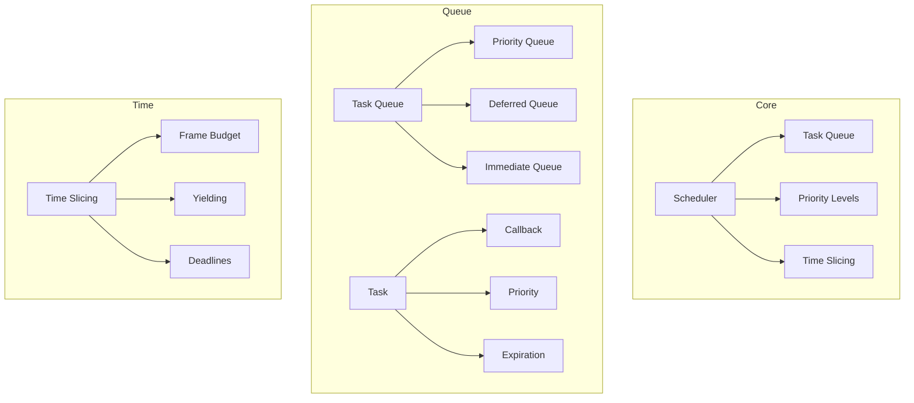
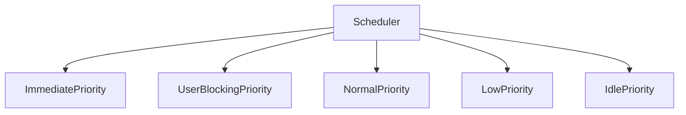
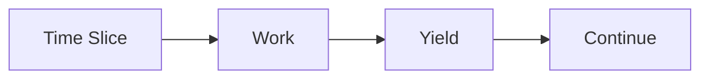
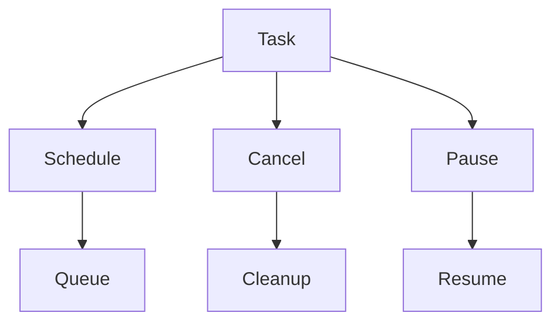
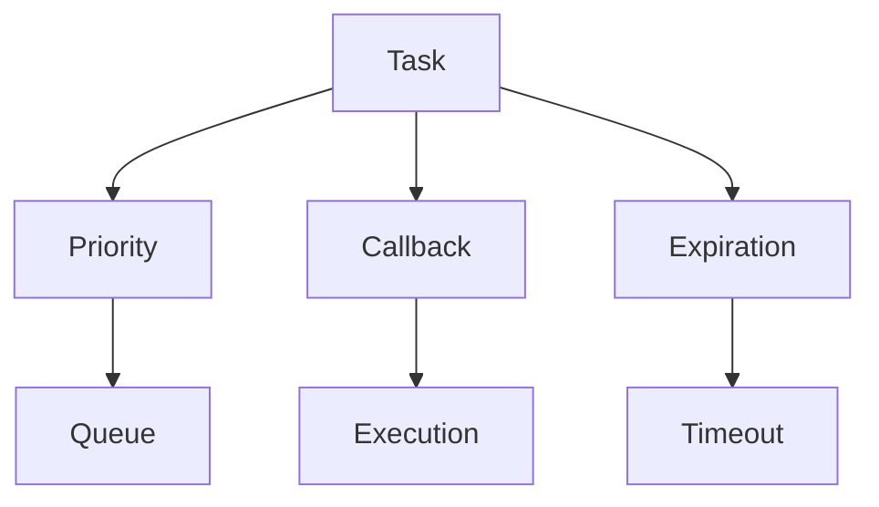
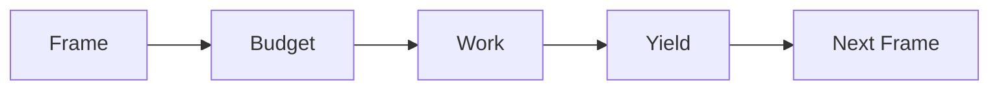

# React Scheduler Package

The `scheduler` package provides cooperative scheduling primitives for React applications, enabling prioritized, interruptible task scheduling that ensures smooth user interactions while managing background work efficiently.

## Architecture



## Key Components

### 1. Task Scheduling


- **ImmediatePriority**: Synchronous, must complete immediately
- **UserBlockingPriority**: User interactions, animations
- **NormalPriority**: Default updates
- **LowPriority**: Data prefetching
- **IdlePriority**: Non-essential work

### 2. Time Slicing


1. **Frame Budget**
   - Default 5ms
   - Adjustable threshold
   - Performance monitoring

2. **Yielding**
   - Check deadline
   - Save progress
   - Resume later

### 3. Task Management


- **Schedule**: Add task to queue
- **Cancel**: Remove from queue
- **Pause/Resume**: Interrupt handling

## Usage

### Basic Scheduling
```javascript
import { scheduleCallback, NormalPriority } from 'scheduler';

function someWork() {
  // Perform work
  return isComplete ? null : someWork;
}

scheduleCallback(NormalPriority, someWork);
```

### Priority Management
```javascript
import {
  scheduleCallback,
  ImmediatePriority,
  UserBlockingPriority,
  NormalPriority
} from 'scheduler';

// High-priority task
scheduleCallback(ImmediatePriority, () => {
  // Critical work
});

// User interaction
scheduleCallback(UserBlockingPriority, () => {
  // Animation or input handling
});

// Background work
scheduleCallback(NormalPriority, () => {
  // Data processing
});
```

### Time Slicing
```javascript
import { scheduleCallback, shouldYield } from 'scheduler';

function processItems(items, startIndex) {
  while (startIndex < items.length) {
    if (shouldYield()) {
      // Continue later from startIndex
      return () => processItems(items, startIndex);
    }
    
    process(items[startIndex]);
    startIndex++;
  }
}

scheduleCallback(NormalPriority, () => processItems(items, 0));
```

## Development

### Building
```bash
# Build the package
yarn build

# Build with profiling
yarn build --profiling
```

### Testing
```bash
# Run all tests
yarn test

# Test specific feature
yarn test --pattern="scheduling"
```

## Architecture Details

### Task Model


### Time Management


## Interactive Knowledge Testing

### Quiz: Scheduler Basics

1. What is the main purpose of the scheduler?
   - [ ] Memory management
   - [x] Task prioritization
   - [ ] State management
   - [ ] Event handling

2. What are the priority levels (from highest to lowest)?
   - [ ] High, Medium, Low
   - [x] Immediate, UserBlocking, Normal, Low, Idle
   - [ ] Critical, Normal, Background
   - [ ] Sync, Async, Deferred

3. What determines if work should yield?
   - [ ] Memory usage
   - [x] Frame deadline
   - [ ] Task count
   - [ ] CPU usage

### Quiz: Task Management

1. How is a task scheduled?
   - [ ] addTask()
   - [x] scheduleCallback()
   - [ ] queueTask()
   - [ ] runTask()

2. What happens when a task yields?
   - [ ] Task is cancelled
   - [x] Continues next frame
   - [ ] Drops priority
   - [ ] Throws error

3. How are long tasks handled?
   - [ ] Run to completion
   - [x] Split across frames
   - [ ] Run in background
   - [ ] Terminate

### Quiz: Time Slicing

1. What is the default frame budget?
   - [ ] 16ms
   - [x] 5ms
   - [ ] 10ms
   - [ ] 1ms

2. When should work yield?
   - [ ] After each operation
   - [x] When deadline reached
   - [ ] Random intervals
   - [ ] Fixed intervals

3. What happens after yielding?
   - [ ] Work is lost
   - [x] Continues later
   - [ ] Starts over
   - [ ] Cancels task

## Contributing

When contributing to Scheduler:

1. Follow the [Contributing Guide](../CONTRIBUTING.md)
2. Test performance impact
3. Consider browser compatibility
4. Maintain backward compatibility
5. Update documentation

## Stability

- 🟢 **Stable**: Core scheduling APIs
- 🟡 **Experimental**: New features
- 🔴 **Internal**: Facebook-specific

## Documentation

- [Scheduler Design](https://react.dev/scheduler)
- [Priority Levels](https://react.dev/scheduler/priorities)
- [Time Slicing](https://react.dev/scheduler/time-slicing)
