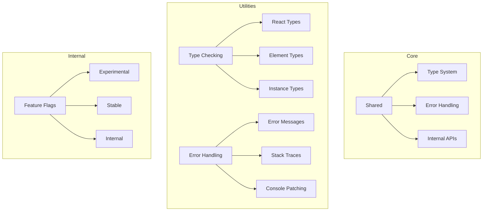
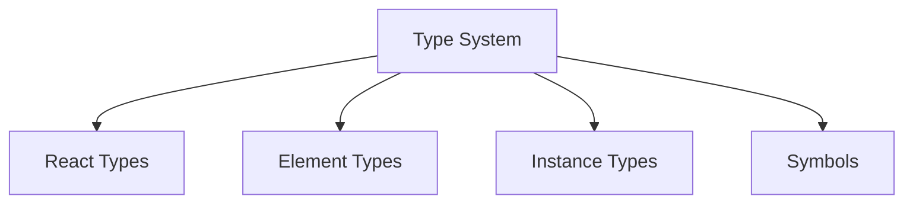
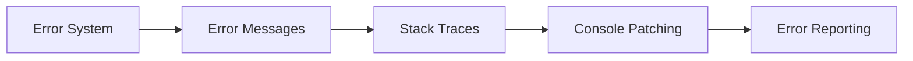
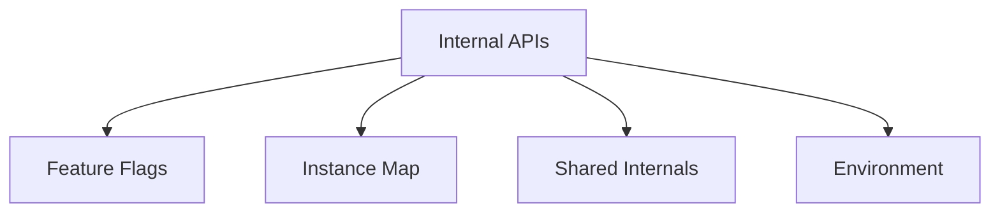
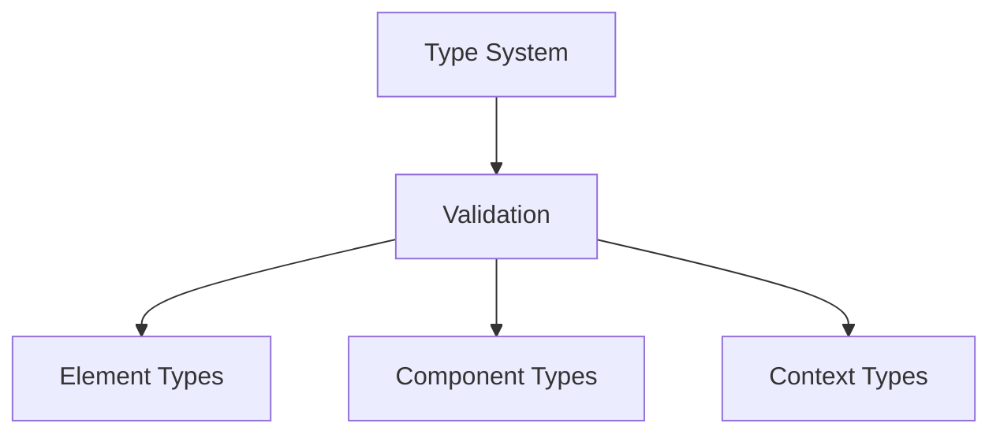
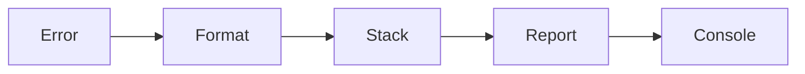

# React Shared Package

The `shared` package contains utilities and shared functionality used across React packages. It provides core functionality for type checking, error handling, and internal React operations.

## Architecture



## Key Components

### 1. Type System


- **React Types**: Core React type definitions
- **Element Types**: React element type checking
- **Instance Types**: Component instance types
- **Symbols**: Internal React symbols

### 2. Error Handling


1. **Error Messages**
   - Production error formatting
   - Development error details
   - Error code system

2. **Stack Traces**
   - Component stack frames
   - Error boundary tracking
   - Source mapping

### 3. Internal APIs


- **Feature Flags**: Experimental features
- **Instance Map**: Component tracking
- **Shared Internals**: Cross-package state
- **Environment**: Runtime detection

## Usage

### Type Checking
```javascript
import {
  REACT_ELEMENT_TYPE,
  REACT_PORTAL_TYPE,
  REACT_FRAGMENT_TYPE
} from 'shared/ReactSymbols';

function isValidElementType(type) {
  return (
    typeof type === 'string' ||
    typeof type === 'function' ||
    type === REACT_FRAGMENT_TYPE ||
    type === REACT_PORTAL_TYPE
  );
}
```

### Error Handling
```javascript
import {
  formatProdErrorMessage,
  reportGlobalError
} from 'shared';

try {
  // Some operation
} catch (error) {
  reportGlobalError(error);
}
```

### Feature Flags
```javascript
import { enableFeature } from 'shared/ReactFeatureFlags';

if (enableFeature) {
  // Use experimental feature
}
```

## Development

### Building
```bash
# Build the package
yarn build

# Build with type checking
yarn build --types
```

### Testing
```bash
# Run all tests
yarn test

# Test specific utility
yarn test --pattern="type"
```

## Architecture Details

### Type System


### Error System


## Contributing

When contributing to Shared:

1. Follow the [Contributing Guide](../CONTRIBUTING.md)
2. Maintain type safety
3. Consider cross-package usage
4. Update documentation
5. Add tests

## Stability

- 🟢 **Stable**: Core utilities
- 🟡 **Experimental**: New features
- 🔴 **Internal**: Facebook-specific

## Documentation

- [Type System](https://react.dev/architecture/types)
- [Error Handling](https://react.dev/architecture/errors)
- [Internal APIs](https://react.dev/architecture/internal) 
