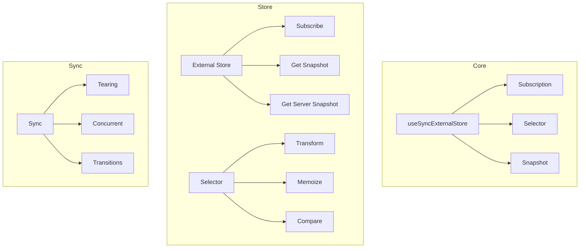
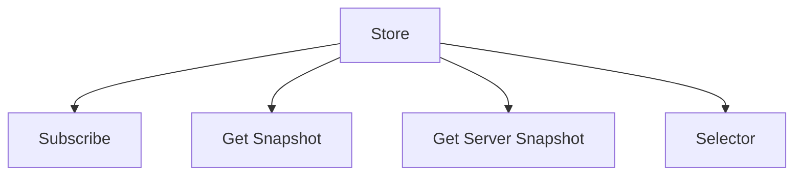
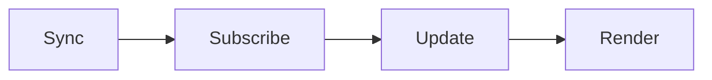
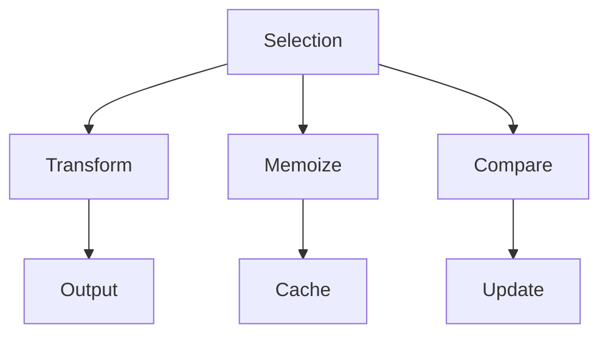
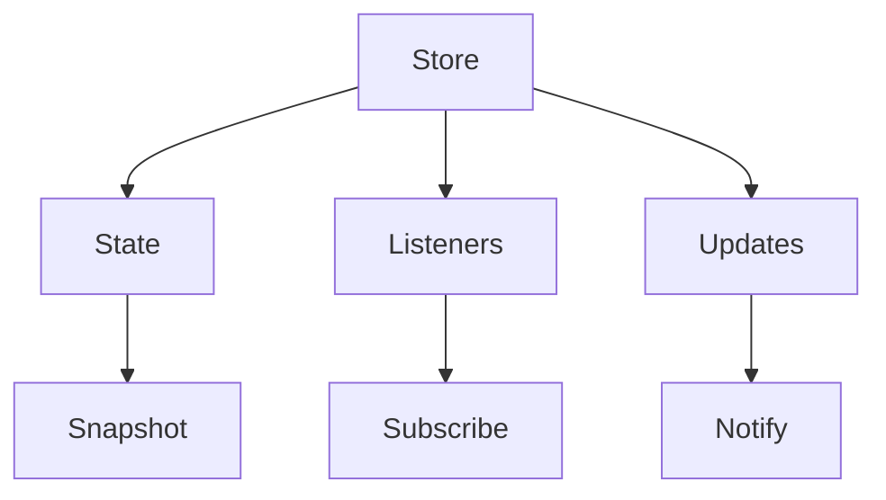
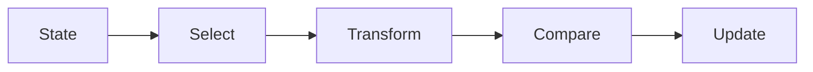

# React useSyncExternalStore Package

The `use-sync-external-store` package provides a React Hook for subscribing to external data sources in a way that's compatible with concurrent rendering features.

## Architecture



## Key Components

### 1. Store Integration


- **Subscribe**: Subscription management
- **Get Snapshot**: Current state retrieval
- **Get Server Snapshot**: SSR support
- **Selector**: State transformation

### 2. Synchronization


1. **Subscribe**
   - Store subscription
   - Change detection
   - Cleanup handling

2. **Update**
   - State updates
   - Concurrent safety
   - Tearing prevention

### 3. Selection


- **Transform**: Data transformation
- **Memoize**: Performance optimization
- **Compare**: Change detection

## Usage

### Basic Store Integration
```javascript
import { useSyncExternalStore } from 'use-sync-external-store/shim';

const store = {
  state: { count: 0 },
  listeners: new Set(),
  
  subscribe(listener) {
    this.listeners.add(listener);
    return () => this.listeners.delete(listener);
  },
  
  getSnapshot() {
    return this.state;
  },
  
  increment() {
    this.state = { count: this.state.count + 1 };
    this.listeners.forEach(listener => listener());
  }
};

function Counter() {
  const state = useSyncExternalStore(
    store.subscribe.bind(store),
    store.getSnapshot.bind(store)
  );
  
  return (
    <div>
      Count: {state.count}
      <button onClick={() => store.increment()}>
        Increment
      </button>
    </div>
  );
}
```

### With Selector
```javascript
import { useSyncExternalStoreWithSelector } from 'use-sync-external-store/with-selector';

function CounterWithSelector() {
  const count = useSyncExternalStoreWithSelector(
    store.subscribe.bind(store),
    store.getSnapshot.bind(store),
    null,
    state => state.count
  );
  
  return (
    <div>
      Count: {count}
      <button onClick={() => store.increment()}>
        Increment
      </button>
    </div>
  );
}
```

### Server Rendering
```javascript
import { useSyncExternalStore } from 'use-sync-external-store/shim/with-selector';

const store = {
  // ... store implementation
  
  getServerSnapshot() {
    return { count: 0 }; // Initial SSR state
  }
};

function ServerCounter() {
  const state = useSyncExternalStore(
    store.subscribe.bind(store),
    store.getSnapshot.bind(store),
    store.getServerSnapshot.bind(store)
  );
  
  return <div>Count: {state.count}</div>;
}
```

## Development

### Building
```bash
# Build the package
yarn build

# Build with profiling
yarn build --profiling
```

### Testing
```bash
# Run all tests
yarn test

# Test specific feature
yarn test --pattern="selector"
```

## Architecture Details

### Store Integration


### Selection Flow


## Interactive Knowledge Testing

### Quiz: Store Basics

1. What is the main purpose of useSyncExternalStore?
   - [ ] State management
   - [x] External store sync
   - [ ] Data fetching
   - [ ] Event handling

2. What are the required store methods?
   - [ ] get, set
   - [x] subscribe, getSnapshot
   - [ ] update, notify
   - [ ] read, write

3. What makes it concurrent safe?
   - [ ] Async updates
   - [x] Tearing prevention
   - [ ] Batching
   - [ ] Throttling

### Quiz: Selection

1. When to use withSelector?
   - [ ] Always
   - [x] Partial state needed
   - [ ] Never
   - [ ] Complex state

2. What does the selector do?
   - [ ] Filter updates
   - [x] Transform state
   - [ ] Cache data
   - [ ] Validate state

3. How is memoization handled?
   - [ ] Manual cache
   - [x] Automatic
   - [ ] No memoization
   - [ ] Custom compare

### Quiz: Server Rendering

1. What is getServerSnapshot for?
   - [ ] Client state
   - [x] SSR state
   - [ ] Testing
   - [ ] Development

2. When is it called?
   - [ ] Every render
   - [x] Server only
   - [ ] Client only
   - [ ] Updates only

3. Is it required?
   - [ ] Always
   - [x] SSR only
   - [ ] Never
   - [ ] Development

## Contributing

When contributing to useSyncExternalStore:

1. Follow the [Contributing Guide](../CONTRIBUTING.md)
2. Test concurrent safety
3. Consider SSR impact
4. Maintain backward compatibility
5. Update documentation

## Stability

- 🟢 **Stable**: Core subscription
- 🟡 **Experimental**: New features
- 🔴 **Internal**: Facebook-specific

## Documentation

- [External Store](https://react.dev/external-store)
- [Store Integration](https://react.dev/store/integration)
- [Concurrent Safety](https://react.dev/store/concurrent)
