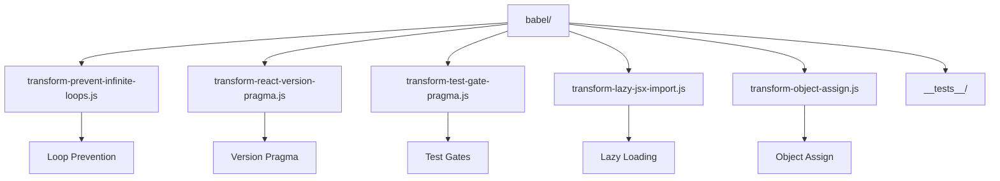
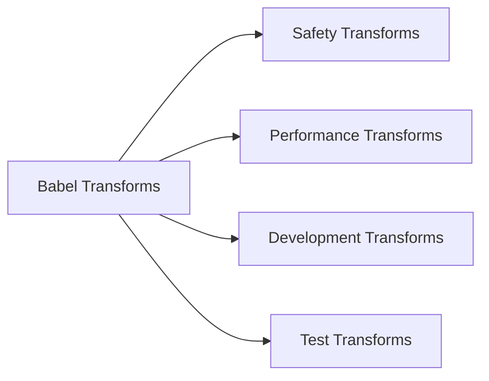
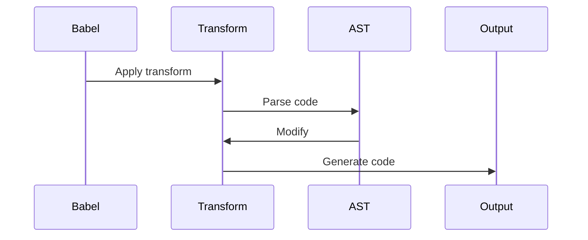

# React Babel Transformations

This directory contains custom Babel transformations used in React's build process. These transformations handle React-specific code modifications and optimizations.

## Architecture



## Transformation Categories



## Key Transformations

### 1. Safety Transformations
- **prevent-infinite-loops**: Prevents infinite loop patterns
- **object-assign**: Polyfills Object.assign
- **lazy-jsx-import**: Optimizes JSX imports

### 2. Development Transformations
- **react-version-pragma**: Handles version-specific code
- **test-gate-pragma**: Manages test-specific code paths

## Transformation Process



## Usage

### Configuration

```javascript
// babel.config.js
module.exports = {
  plugins: [
    require('./scripts/babel/transform-prevent-infinite-loops'),
    require('./scripts/babel/transform-react-version-pragma'),
    require('./scripts/babel/transform-test-gate-pragma')
  ]
};
```

### Transformation Details

1. **prevent-infinite-loops**
   - Detects potential infinite loops
   - Adds safety checks
   - Example: `while (true)` → `while (true && !__DEV__)`

2. **react-version-pragma**
   - Handles version-specific code
   - Manages feature flags
   - Example: `// @reactVersion >= 16.8.0`

3. **test-gate-pragma**
   - Controls test-specific code
   - Manages test environments
   - Example: `// @gate experimental`

## Testing

Each transformation includes its own test suite:

```bash
# Run tests for a specific transform
yarn test transform-prevent-infinite-loops

# Run all transform tests
yarn test
```

## Contributing

When adding new transformations:

1. Follow Babel's plugin patterns
2. Include comprehensive tests
3. Document the transform's purpose
4. Update the README if needed 
