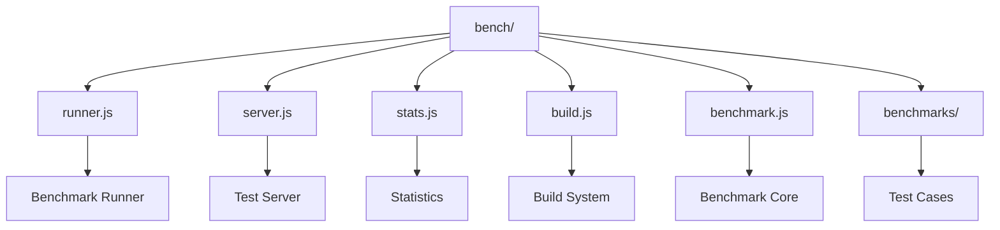
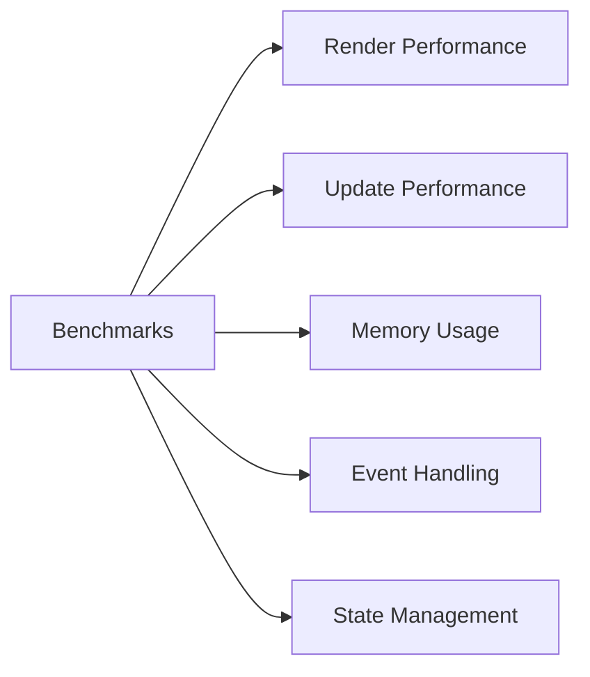
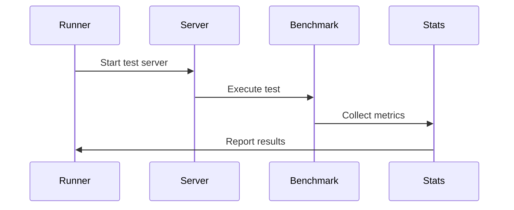

# React Benchmarking System

This directory contains the benchmarking system for React, which helps measure and analyze the performance of React components and features under various conditions.

## Architecture



## Benchmark Categories



## Key Components

### 1. Benchmark Runner (`runner.js`)
- Executes benchmark suites
- Manages test iterations
- Handles result collection
- Controls test environment

### 2. Test Server (`server.js`)
- Serves benchmark pages
- Manages test scenarios
- Handles client communication
- Provides test isolation

### 3. Statistics (`stats.js`)
- Performance metrics collection
- Statistical analysis
- Result visualization
- Performance regression detection

### 4. Build System (`build.js`)
- Benchmark bundle creation
- Test environment setup
- Dependency management
- Build optimization

## Benchmark Process



## Usage

### Running Benchmarks

```bash
# Run all benchmarks
yarn bench

# Run specific benchmark
yarn bench --benchmark=render

# Run with custom iterations
yarn bench --iterations=1000

# Run in CI mode
yarn bench --ci
```

### Benchmark Configuration

Each benchmark can be configured through command-line options:

- `--benchmark`: Specific benchmark to run
- `--iterations`: Number of test iterations
- `--warmup`: Warmup iterations
- `--ci`: CI mode with stricter checks

## Benchmark Types

1. **Render Performance**
   - Initial render time
   - Component mount time
   - Tree reconciliation
   - DOM operations

2. **Update Performance**
   - State updates
   - Props changes
   - Context updates
   - Event handling

3. **Memory Usage**
   - Heap allocation
   - Garbage collection
   - Memory leaks
   - Object retention

## Results Analysis

The benchmarking system provides:

- Performance metrics
- Statistical significance
- Regression detection
- Comparative analysis
- Visualization tools

## Contributing

When adding new benchmarks:

1. Follow existing benchmark patterns
2. Include proper setup/teardown
3. Add statistical validation
4. Update documentation
