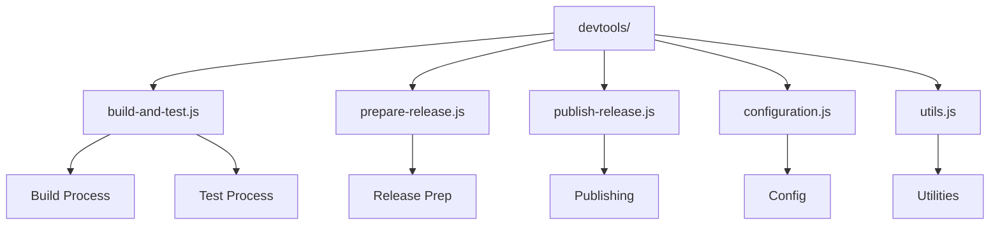
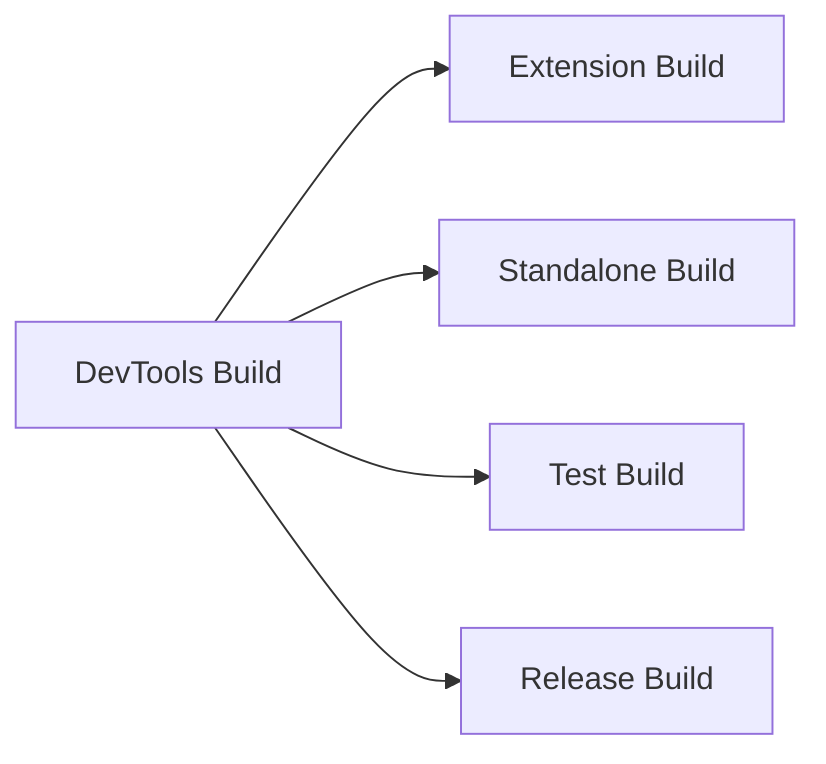
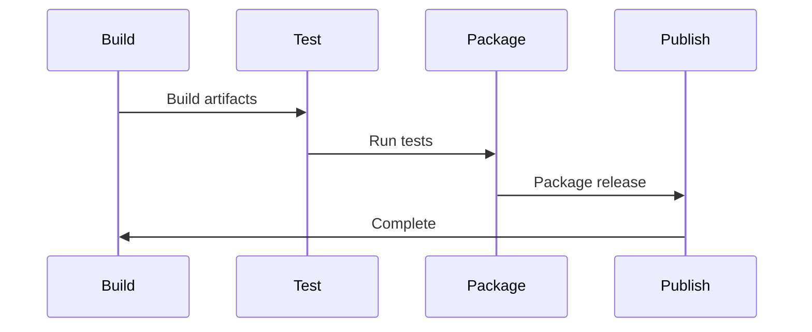

# React DevTools Build System

This directory contains the build and release scripts for React DevTools. It manages the process of building, testing, and publishing the DevTools extension and standalone app.

## Architecture



## Build Components



## Key Components

### 1. Build System (`build-and-test.js`)
- Builds DevTools extension
- Builds standalone app
- Runs tests
- Handles different build types

### 2. Release Preparation (`prepare-release.js`)
- Prepares release artifacts
- Updates version numbers
- Generates changelog
- Validates builds

### 3. Publishing (`publish-release.js`)
- Publishes to Chrome Web Store
- Publishes to Firefox Add-ons
- Updates documentation
- Manages release tags

### 4. Configuration (`configuration.js`)
- Build configurations
- Environment settings
- Release channels
- Platform-specific settings

## Build Process



## Usage

### Building DevTools

```bash
# Build and test
yarn build-and-test

# Build for specific platform
yarn build-and-test --platform=chrome

# Build for release
yarn build-and-test --release
```

### Release Process

```bash
# Prepare release
yarn prepare-release

# Publish release
yarn publish-release

# Test release
yarn test-release
```

## Build Types

1. **Development Build**
   - Debug features enabled
   - Source maps included
   - Development warnings

2. **Production Build**
   - Optimized code
   - Minified bundles
   - Production warnings

3. **Test Build**
   - Test utilities
   - Mock implementations
   - Test-specific features

## Configuration Options

- `--platform`: Target platform (chrome/firefox)
- `--release`: Build for release
- `--test`: Include test builds
- `--debug`: Enable debug features

## Contributing

When working with DevTools builds:

1. Test on all platforms
2. Verify extension functionality
3. Check standalone app
4. Update documentation
