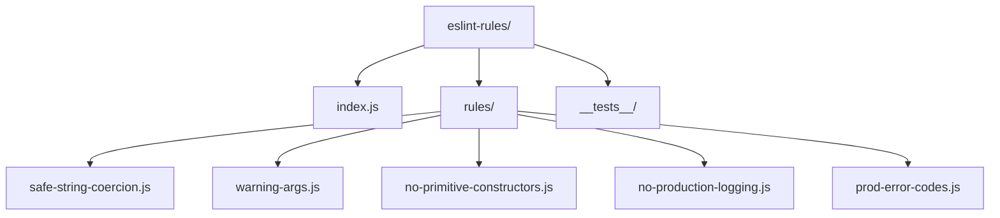
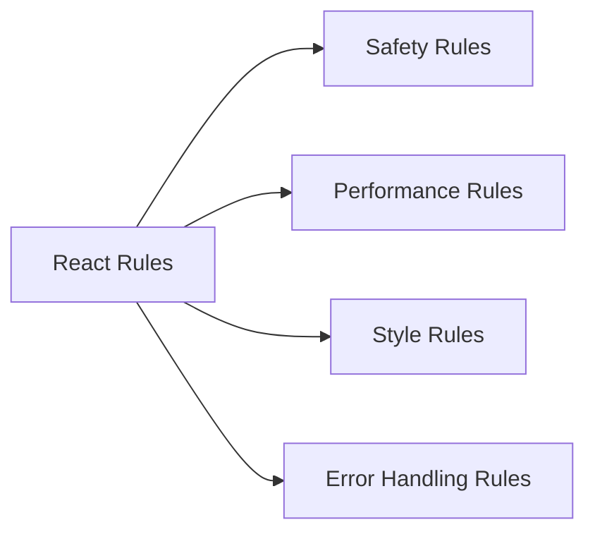
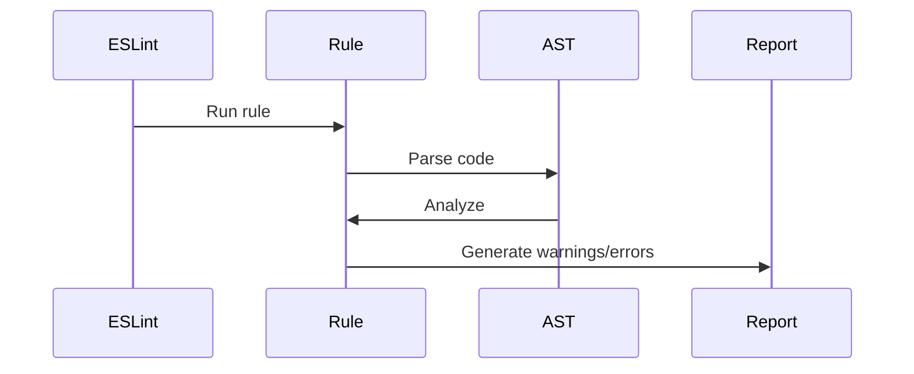

# React ESLint Rules

This directory contains custom ESLint rules specifically designed for React's codebase. These rules enforce React-specific coding standards and best practices.

## Architecture



## Rule Categories



## Key Rules

### 1. Safety Rules
- **safe-string-coercion**: Ensures safe string type coercion
- **no-primitive-constructors**: Prevents use of primitive constructors
- **warning-args**: Validates warning message arguments

### 2. Production Rules
- **no-production-logging**: Prevents console logging in production
- **prod-error-codes**: Enforces error code usage in production

## Rule Implementation



## Usage

### Configuration

```javascript
{
  "plugins": ["react-internal"],
  "rules": {
    "react-internal/safe-string-coercion": "error",
    "react-internal/no-production-logging": "error",
    "react-internal/warning-args": "error"
  }
}
```

### Rule Details

1. **safe-string-coercion**
   - Prevents unsafe string conversions
   - Enforces explicit type checking
   - Example: `String(value)` instead of `value + ''`

2. **warning-args**
   - Validates warning message format
   - Ensures proper error codes
   - Example: `warning(false, 'Error: %s', message)`

3. **no-production-logging**
   - Prevents console statements in production
   - Enforces proper error handling
   - Example: Use `warning()` instead of `console.warn()`

## Testing

Each rule includes its own test suite:

```bash
# Run tests for a specific rule
yarn test safe-string-coercion

# Run all rule tests
yarn test
```

## Contributing

When adding new rules:

1. Follow the existing rule patterns
2. Include comprehensive tests
3. Document the rule's purpose
4. Update the README if needed
