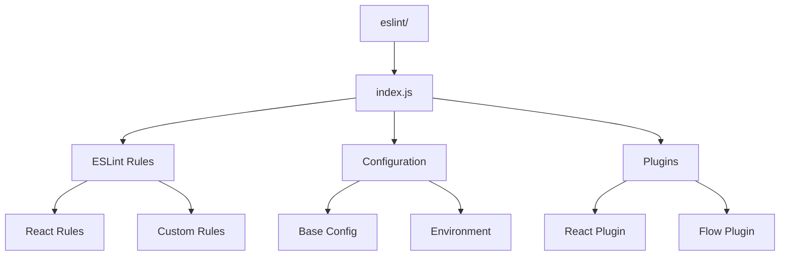
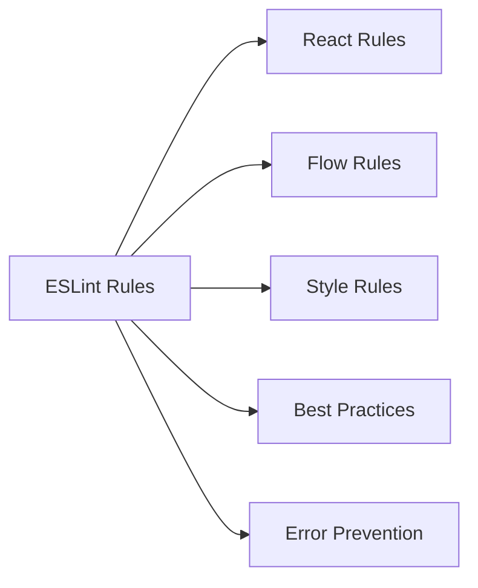
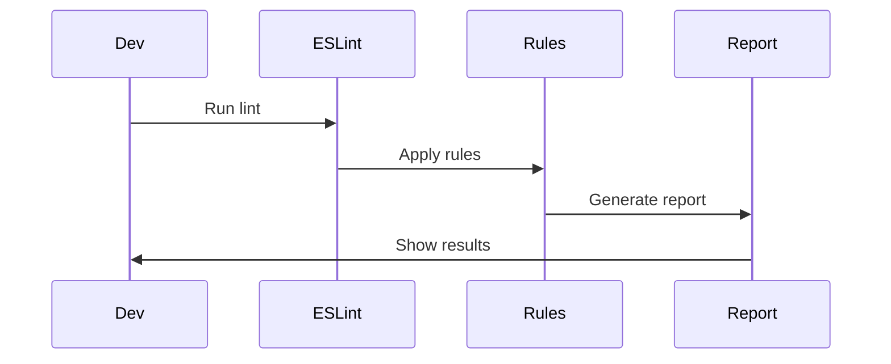

# React ESLint Configuration

This directory contains the ESLint configuration and rules for the React project. It ensures consistent code style and quality across the React codebase.

## Architecture



## Rule Categories



## Key Components

### 1. Configuration (`index.js`)
- Base ESLint configuration
- Rule definitions
- Plugin integration
- Environment settings

### 2. React Rules
- Component naming
- Props validation
- State management
- Lifecycle methods

### 3. Flow Rules
- Type checking
- Type definitions
- Flow annotations
- Type safety

### 4. Style Rules
- Code formatting
- Naming conventions
- Import/export rules
- Comment style

## Linting Process



## Usage

### Running ESLint

```bash
# Run ESLint
yarn lint

# Run with auto-fix
yarn lint --fix

# Run on specific files
yarn lint src/

# Run in CI mode
yarn lint --ci
```

### Configuration Options

ESLint can be configured through:

- Command line options
- `.eslintrc` files
- Package.json
- Environment variables

## Rule Types

1. **React Rules**
   - Component structure
   - Props validation
   - State management
   - Lifecycle methods

2. **Flow Rules**
   - Type checking
   - Type definitions
   - Flow annotations
   - Type safety

3. **Style Rules**
   - Code formatting
   - Naming conventions
   - Import/export rules
   - Comment style

## Contributing

When adding new rules:

1. Follow ESLint best practices
2. Add proper documentation
3. Include test cases
4. Update configuration 
