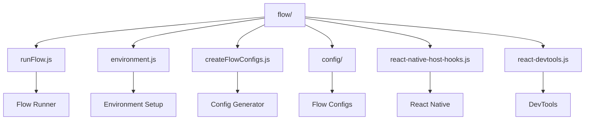
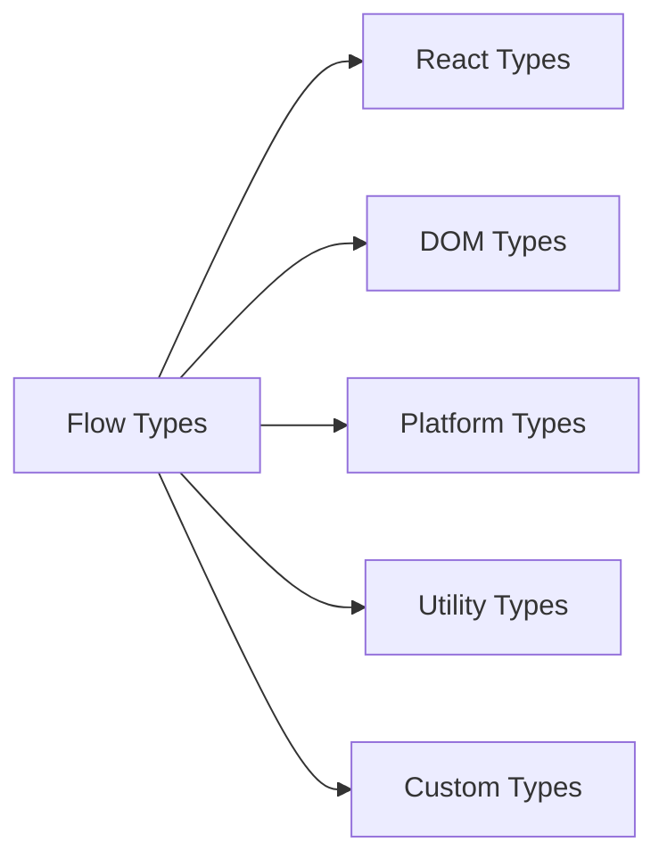
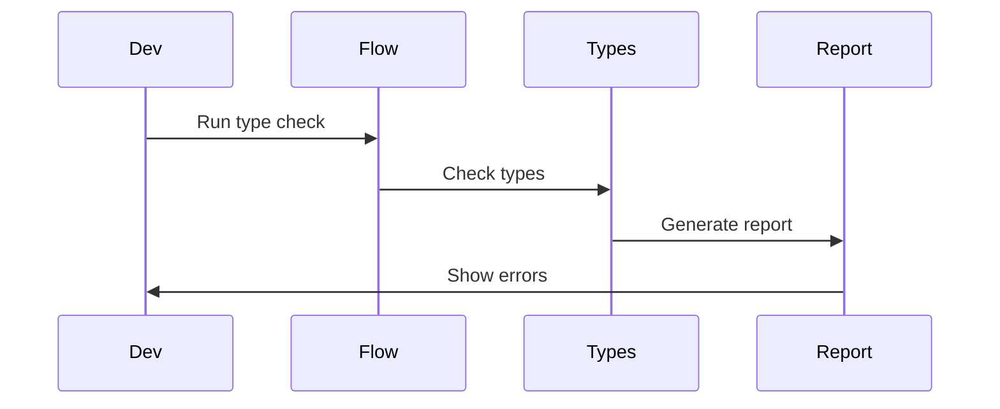

# React Flow Configuration

This directory contains the Flow type checking configuration and utilities for the React project. It ensures type safety and helps catch potential type-related errors early in development.

## Architecture



## Type System



## Key Components

### 1. Flow Runner (`runFlow.js`)
- Type checking execution
- Error reporting
- Configuration loading
- Performance optimization

### 2. Environment Setup (`environment.js`)
- Type definitions
- Global types
- Platform-specific types
- Development tools

### 3. Config Generator (`createFlowConfigs.js`)
- Configuration templates
- Platform-specific configs
- Build-time configs
- Development configs

### 4. React Native Integration (`react-native-host-hooks.js`)
- React Native types
- Native module types
- Platform APIs
- Bridge types

## Type Checking Process



## Usage

### Running Flow

```bash
# Run Flow type checking
yarn flow

# Run with specific config
yarn flow --config=config/development

# Run in CI mode
yarn flow --ci

# Run with watch mode
yarn flow --watch
```

### Configuration Options

Flow can be configured through:

- `.flowconfig` files
- Command line options
- Environment variables
- Platform-specific configs

## Type Categories

1. **React Types**
   - Component types
   - Props types
   - State types
   - Context types

2. **DOM Types**
   - Element types
   - Event types
   - Style types
   - Attribute types

3. **Platform Types**
   - React Native types
   - Web types
   - Server types
   - Test types

## Contributing

When adding new types:

1. Follow Flow best practices
2. Add proper documentation
3. Include test cases
4. Update configuration 
