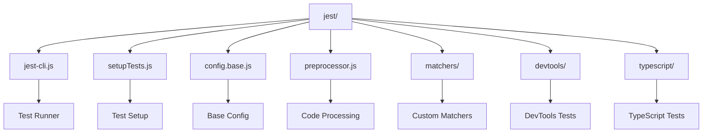
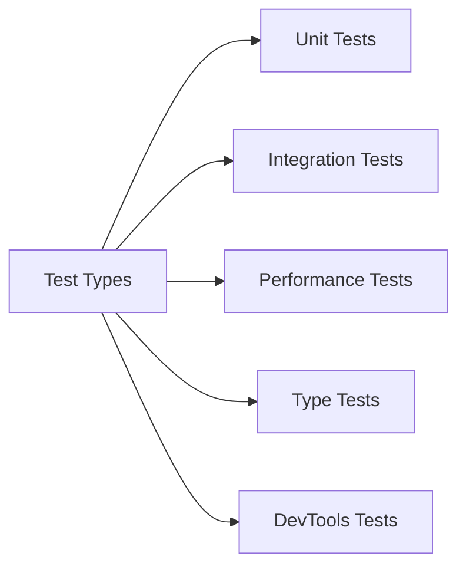
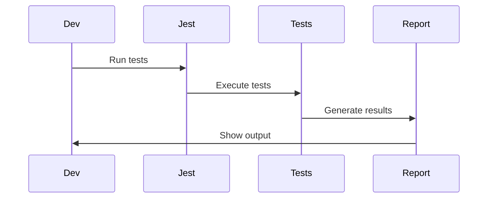

# React Jest Testing System

This directory contains the Jest testing configuration and utilities for the React project. It provides a comprehensive testing environment for React components, hooks, and features.

## Architecture



## Test Categories



## Key Components

### 1. Test Runner (`jest-cli.js`)
- Test execution
- Environment setup
- Result reporting
- Performance optimization

### 2. Test Setup (`setupTests.js`)
- Global test setup
- Mock implementations
- Environment configuration
- Test utilities

### 3. Configuration (`config.base.js`)
- Base test configuration
- Environment settings
- Module resolution
- Test patterns

### 4. Code Processing (`preprocessor.js`)
- Code transformation
- Source map generation
- Module resolution
- Test optimization

## Testing Process



## Usage

### Running Tests

```bash
# Run all tests
yarn test

# Run specific test
yarn test path/to/test

# Run in watch mode
yarn test --watch

# Run with coverage
yarn test --coverage
```

### Test Configuration

Tests can be configured through:

- Command line options
- Jest config files
- Environment variables
- Test setup files

## Test Types

1. **Unit Tests**
   - Component tests
   - Hook tests
   - Utility tests
   - API tests

2. **Integration Tests**
   - Component interaction
   - Feature integration
   - System behavior
   - End-to-end tests

3. **Performance Tests**
   - Render performance
   - Update performance
   - Memory usage
   - CPU usage

## Contributing

When adding new tests:

1. Follow testing best practices
2. Add proper documentation
3. Include test cases
4. Update configuration 
