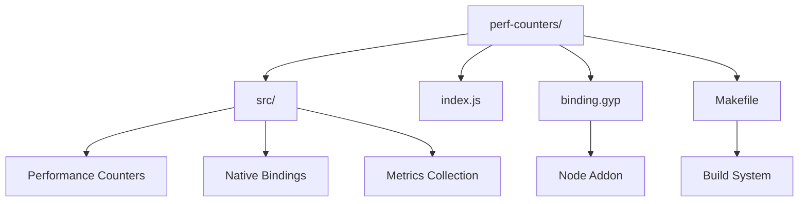
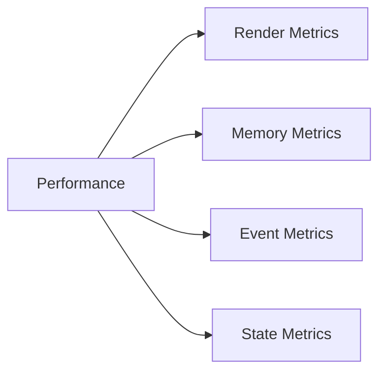
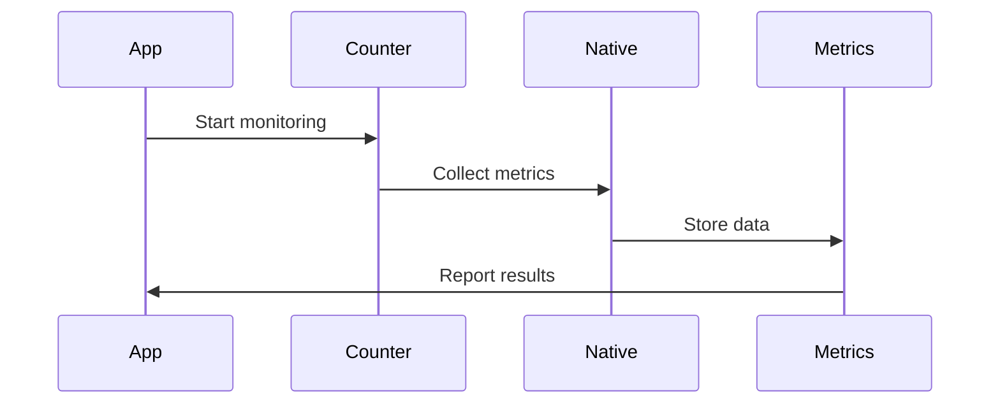

# React Performance Counters

This directory contains native performance monitoring tools for React. It provides low-level performance metrics and counters for analyzing React's runtime behavior.

## Architecture



## Performance Metrics



## Key Components

### 1. Native Bindings (`binding.gyp`)
- Node.js native addon configuration
- Performance counter bindings
- Platform-specific optimizations
- Memory management

### 2. Performance Counters (`src/`)
- Render time tracking
- Memory usage monitoring
- Event handling metrics
- State update tracking

### 3. Build System (`Makefile`)
- Native module compilation
- Platform-specific builds
- Development setup
- Testing environment

## Performance Monitoring Process



## Usage

### Installation

```bash
# Build native module
make

# Install dependencies
yarn install
```

### Performance Monitoring

```javascript
const perfCounters = require('perf-counters');

// Start monitoring
perfCounters.start();

// Get metrics
const metrics = perfCounters.getMetrics();

// Stop monitoring
perfCounters.stop();
```

## Metrics Types

1. **Render Metrics**
   - Component render time
   - Reconciliation time
   - DOM update time
   - Batch processing time

2. **Memory Metrics**
   - Heap usage
   - Object allocation
   - Garbage collection
   - Memory leaks

3. **Event Metrics**
   - Event handling time
   - Event propagation
   - Synthetic events
   - Event batching

## Configuration

The performance counters support various options:

- `--interval`: Sampling interval
- `--metrics`: Specific metrics to track
- `--output`: Output format
- `--threshold`: Performance thresholds

## Contributing

When working with performance counters:

1. Test on all platforms
2. Verify metric accuracy
3. Consider performance impact
4. Update documentation

```
$ node
> var PerfCounters = require('perf-counters');
> PerfCounters.init();
> var start = PerfCounters.getCounters(); console.log('test'); var end = PerfCounters.getCounters();
test
> start
{ instructions: 1382, loads: 421, stores: 309 }
> end
{ instructions: 647633, loads: 195771, stores: 133246 }
>
```
