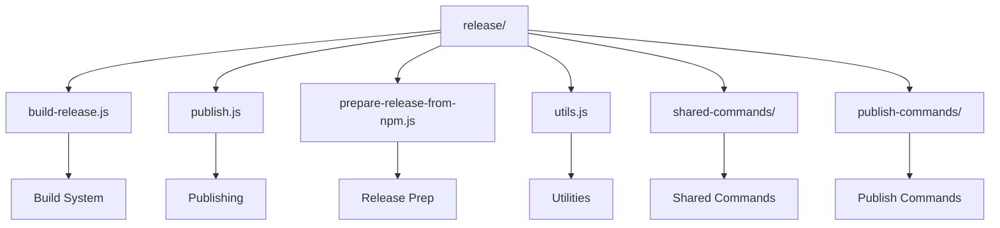
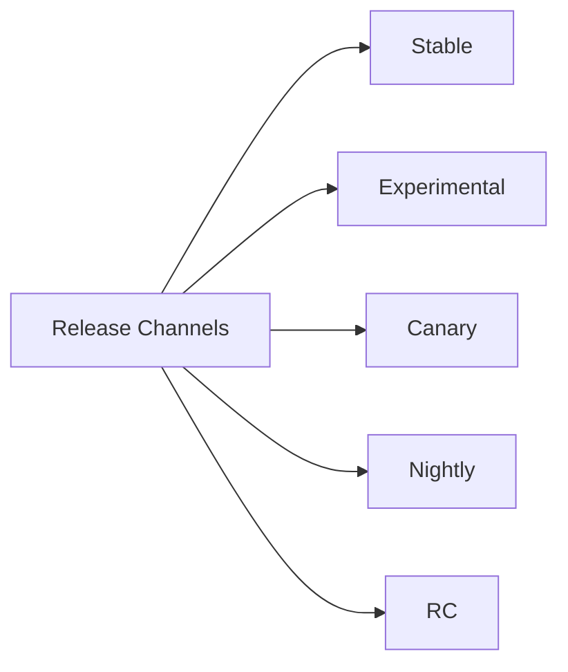
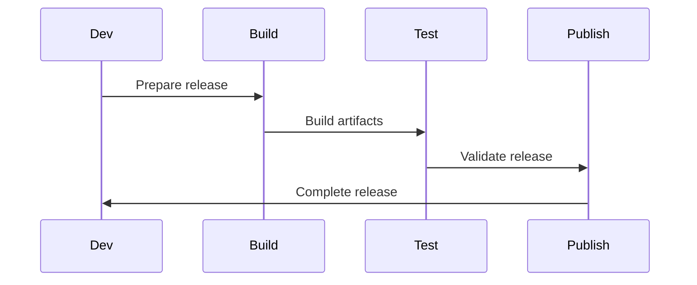

# React Release System

This directory contains the release management system for React. It handles the process of building, testing, and publishing React releases across different channels and platforms.

## Architecture



## Release Channels



## Key Components

### 1. Build System (`build-release.js`)
- Release artifact creation
- Version management
- Build optimization
- Artifact validation

### 2. Publishing (`publish.js`)
- NPM package publishing
- Release channel management
- Version tagging
- Release notes

### 3. Release Preparation (`prepare-release-from-npm.js`)
- Release candidate preparation
- Version validation
- Dependency checking
- Release testing

### 4. Utilities (`utils.js`)
- Version management
- Dependency checking
- Release validation
- Error handling

## Release Process



## Usage

### Release Management

```bash
# Build release
yarn build-release

# Publish release
yarn publish-release

# Prepare release
yarn prepare-release

# Check dependencies
yarn check-dependencies
```

### Release Configuration

Releases can be configured through:

- Command line options
- Environment variables
- Release channels
- Version numbers

## Release Types

1. **Stable Releases**
   - Production-ready
   - Long-term support
   - Backward compatible
   - Security updates

2. **Experimental Releases**
   - New features
   - Breaking changes
   - Development preview
   - Feedback collection

3. **Release Candidates**
   - Pre-release testing
   - Bug fixes
   - Performance testing
   - Compatibility checks

## Contributing

When working with releases:

1. Follow release guidelines
2. Test thoroughly
3. Document changes
4. Update version numbers
