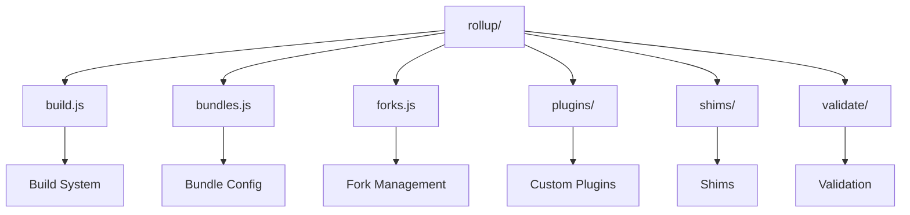
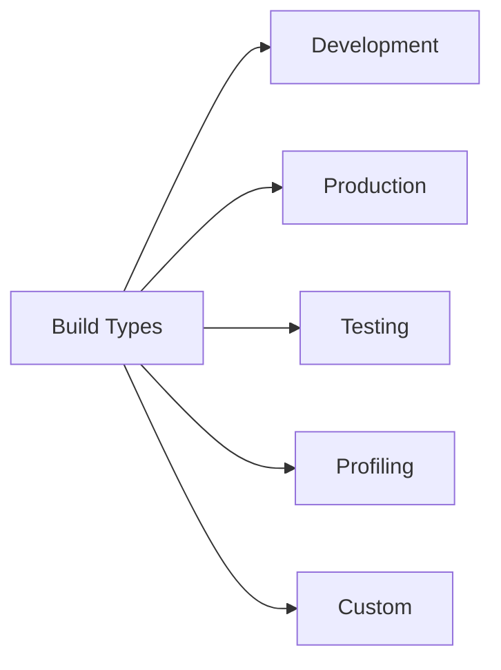
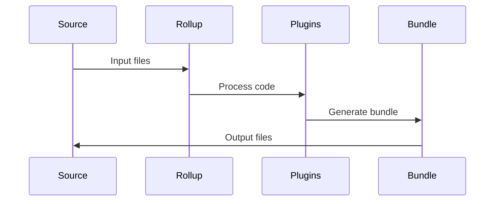

# React Rollup Build System

This directory contains the Rollup-based build system for React. It handles the bundling and optimization of React's source code for different environments and platforms.

## Architecture



## Build Types



## Key Components

### 1. Build System (`build.js`)
- Bundle creation
- Code optimization
- Source map generation
- Build configuration

### 2. Bundle Configuration (`bundles.js`)
- Bundle definitions
- Entry points
- Output formats
- External dependencies

### 3. Fork Management (`forks.js`)
- Platform-specific builds
- Feature flags
- Environment variations
- Build customization

### 4. Custom Plugins (`plugins/`)
- Code transformation
- Bundle optimization
- Dependency resolution
- Asset handling

## Build Process



## Usage

### Building React

```bash
# Build all bundles
yarn build

# Build specific bundle
yarn build --bundle=react

# Build for production
yarn build --production

# Build with profiling
yarn build --profiling
```

### Build Configuration

Builds can be configured through:

- Command line options
- Bundle configurations
- Environment variables
- Custom plugins

## Bundle Types

1. **Development Bundles**
   - Debug features
   - Source maps
   - Development warnings
   - Unminified code

2. **Production Bundles**
   - Optimized code
   - Minified output
   - Production warnings
   - Performance optimized

3. **Testing Bundles**
   - Test utilities
   - Mock implementations
   - Test-specific features
   - Coverage support

## Contributing

When working with the build system:

1. Follow build guidelines
2. Test all bundle types
3. Update documentation
4. Consider performance impact 
