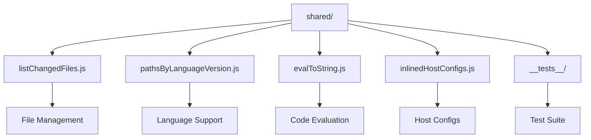
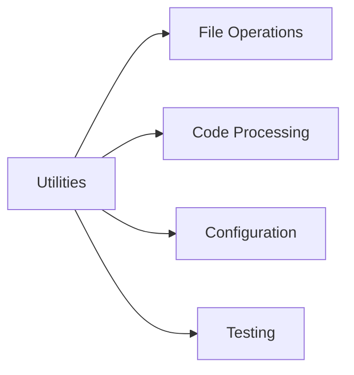
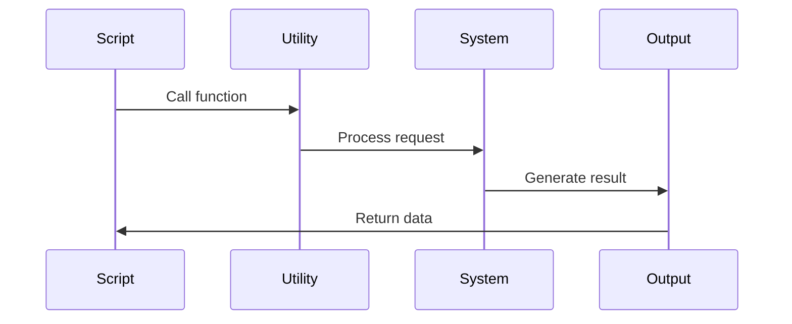

# React Shared Utilities

This directory contains shared utilities and helper functions used across different scripts in the React build and development process.

## Architecture



## Utility Categories



## Key Components

### 1. File Management (`listChangedFiles.js`)
- Git integration
- File tracking
- Change detection
- Path resolution

### 2. Language Support (`pathsByLanguageVersion.js`)
- Language version mapping
- Path configuration
- Version management
- Build settings

### 3. Code Evaluation (`evalToString.js`)
- Code evaluation
- String conversion
- Expression handling
- Runtime support

### 4. Host Configurations (`inlinedHostConfigs.js`)
- Platform configs
- Host environment setup
- Build variations
- Feature flags

## Utility Process



## Usage

### File Operations

```javascript
const {listChangedFiles} = require('./listChangedFiles');

// Get changed files
const files = await listChangedFiles();

// Process specific paths
const paths = await getLanguagePaths('stable');
```

### Configuration Options

Utilities can be configured through:

- Function parameters
- Environment variables
- Configuration files
- Command line options

## Utility Types

1. **File Operations**
   - File listing
   - Path resolution
   - Change detection
   - Directory management

2. **Code Processing**
   - Code evaluation
   - String conversion
   - AST manipulation
   - Code generation

3. **Configuration Management**
   - Host configs
   - Build settings
   - Environment setup
   - Feature flags

## Contributing

When adding new utilities:

1. Follow utility patterns
2. Add proper documentation
3. Include test cases
4. Consider reusability 
