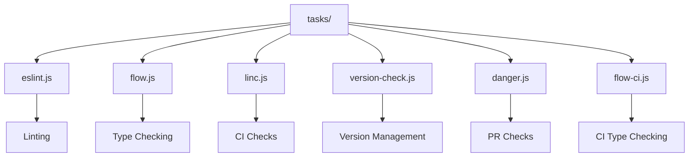
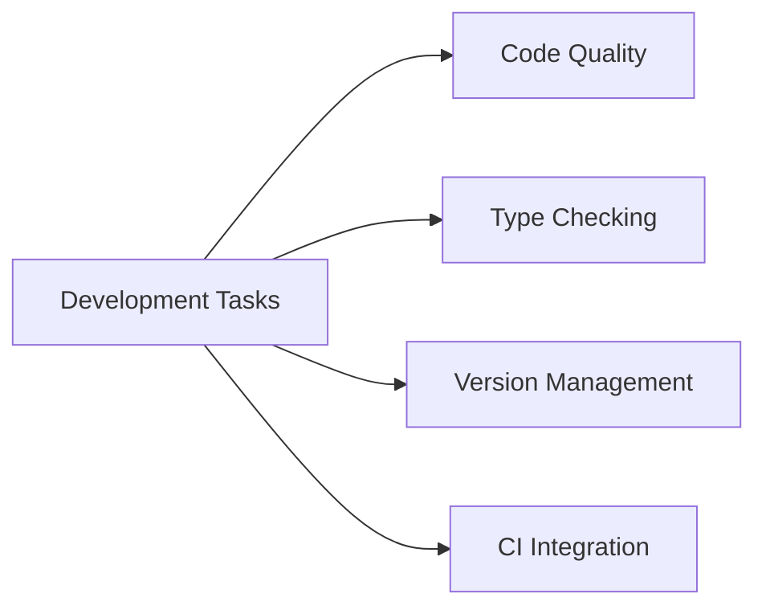
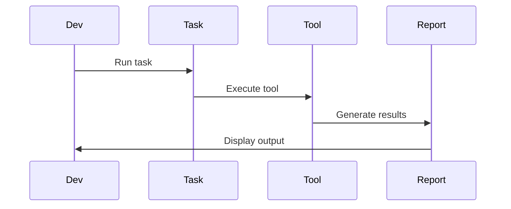

# React Development Tasks

This directory contains utility scripts for managing various development tasks in the React project. These scripts handle common development workflows, code quality checks, and project maintenance tasks.

## Architecture



## Task Categories



## Key Components

### 1. Code Quality (`eslint.js`, `linc.js`)
- ESLint configuration and execution
- Lint-in-CI checks
- Code style enforcement
- Error reporting

### 2. Type Checking (`flow.js`, `flow-ci.js`)
- Flow type checking
- CI type checking
- Type error reporting
- Type definition validation

### 3. Version Management (`version-check.js`)
- Version number validation
- Dependency version checks
- Release version tracking
- Version compatibility

### 4. CI Integration (`danger.js`)
- Pull request checks
- Code review automation
- CI workflow integration
- Quality gate enforcement

## Task Execution Process



## Usage

### Running Tasks

```bash
# Run ESLint
yarn lint

# Run Flow type checking
yarn flow

# Run CI checks
yarn linc

# Check versions
yarn version-check
```

### Task Configuration

Each task can be configured through command-line options:

- `--fix`: Automatically fix issues
- `--watch`: Run in watch mode
- `--ci`: Run in CI mode
- `--verbose`: Show detailed output

## Task Types

1. **Code Quality Tasks**
   - Linting
   - Code style
   - Best practices
   - Error checking

2. **Type Checking Tasks**
   - Flow type checking
   - Type definition validation
   - Type error reporting
   - CI type checking

3. **Version Management Tasks**
   - Version validation
   - Dependency checking
   - Release tracking
   - Compatibility checks

## Contributing

When adding new tasks:

1. Follow existing task patterns
2. Include proper error handling
3. Add configuration options
4. Update documentation 
